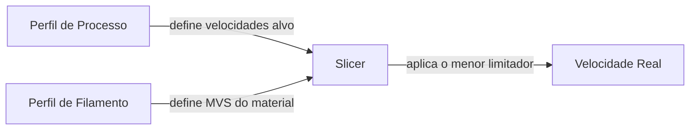
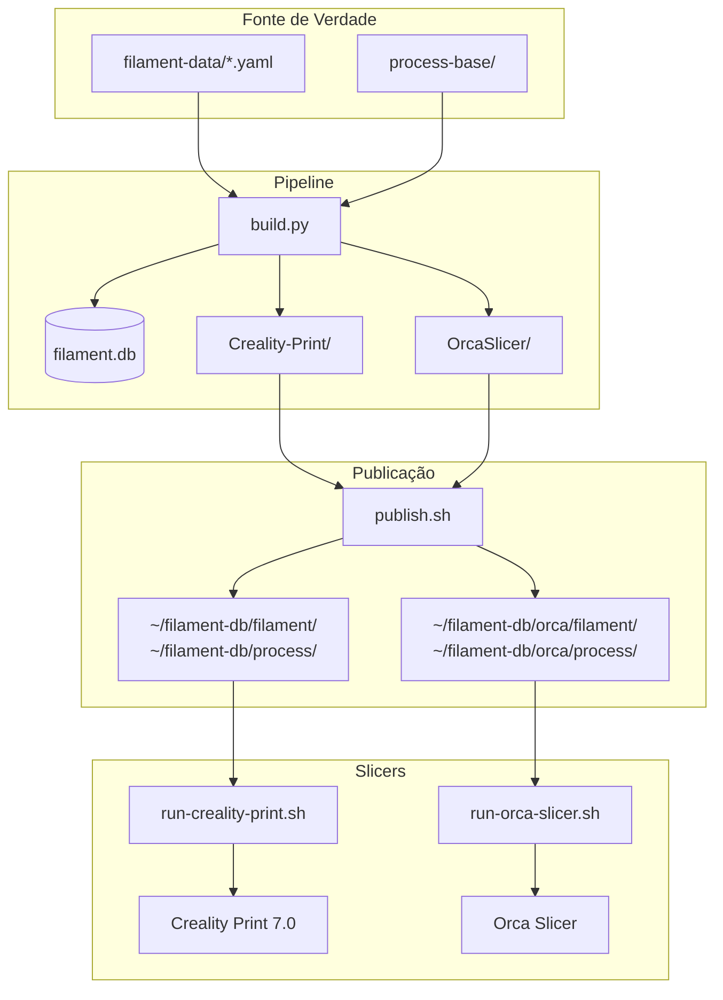
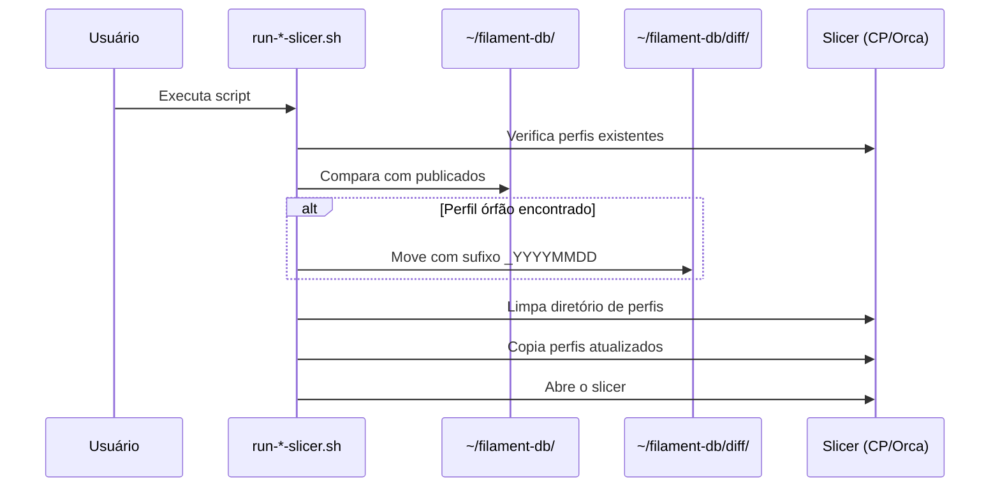
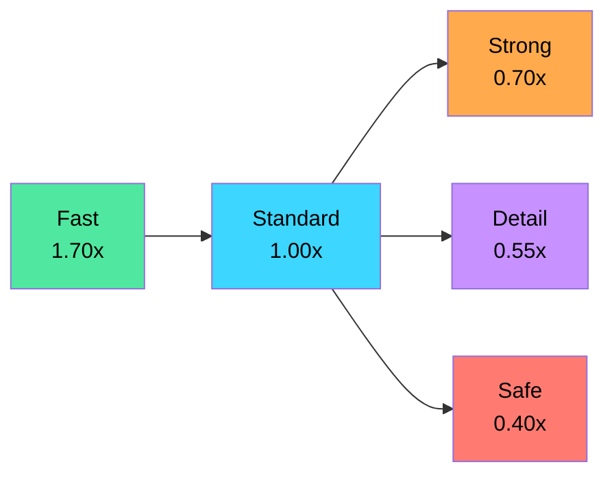
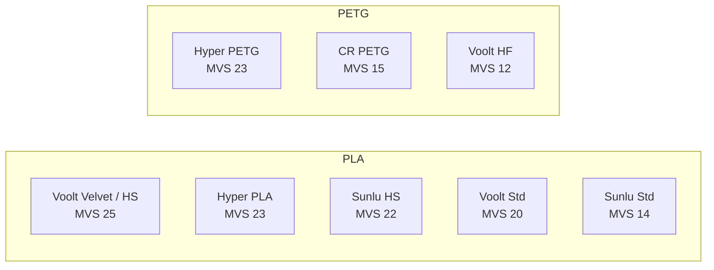
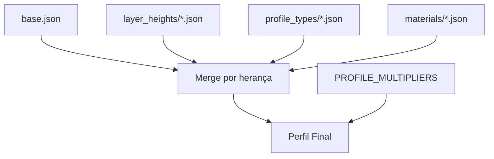

# FilamentDB

Banco de dados de perfis de filamentos e configurações de processo para impressoras 3D, focado na **Creality K2 Combo** com **Creality Print 7.0** e **Orca Slicer**.

## Filosofia: Separação de Responsabilidades



| Componente | Responsabilidade | Exemplo |
|------------|------------------|---------|
| **Perfil de Processo** | Velocidades alvo da *impressora* + estrutura da peça | 500 mm/s inner wall no Fast |
| **Perfil de Filamento** | Limite de fluxo do *material* (`filament_max_volumetric_speed`) | Voolt3D Velvet: 25 mm³/s |
| **Slicer** | Combina os dois em runtime, aplica o menor limitador | `max_speed = MVS / (layer_height × line_width)` |

### Por que essa abordagem?

Perfis de processo que limitam velocidades com base no material penalizam filamentos premium. Um PLA Silk (MVS=12) e um PLA High Speed (MVS=25) teriam o mesmo perfil de processo, mas capacidades completamente diferentes.

Com a separação:
- O perfil de processo define o **potencial da máquina** para cada profile type
- O filamento define o **limite do material**
- Filamentos premium aproveitam o máximo da K2, filamentos lentos são contidos sem configuração extra

## Arquitetura



### Fluxo de Sincronização dos Slicers



## Hierarquia de Perfis de Processo



| Profile Type | Foco | Walls | Infill | Speed × | Accel × |
|--------------|------|-------|--------|---------|---------|
| **Fast** | Velocidade máxima | 3 | 12% grid | 1.70 | 2.00 |
| **Standard** | Equilíbrio geral | 4 | 15% gyroid | 1.00 | 1.00 |
| **Strong** | Resistência mecânica | 6 | 55% | 0.70 | 0.60 |
| **Detail** | Qualidade visual (0.08-0.16mm) | 5 | 20% gyroid | 0.55 | 0.45 |
| **Safe** | Ultra-conservador | 4 | 18% gyroid | 0.40 | 0.30 |

## MVS dos Filamentos Principais



| Filamento | MVS (mm³/s) | Cap @0.20mm |
|-----------|-------------|-------------|
| Voolt3D Velvet | 25 | ~277 mm/s |
| Voolt3D PLA HS | 25 | ~277 mm/s |
| Creality Hyper PLA | 23 | ~255 mm/s |
| Sunlu PLA HS | 22 | ~244 mm/s |
| Voolt3D PLA Standard | 20 | ~222 mm/s |
| Creality Hyper PETG | 23 | ~255 mm/s |
| Sunlu PLA Meta | 18 | ~199 mm/s |
| Creality CR PETG | 15 | ~166 mm/s |
| Voolt3D PETG HF | 12 | ~133 mm/s |
| Sunlu PETG | 12 | ~133 mm/s |

*Cap = MVS / (0.20 × 0.45)*

## Uso rápido

```bash
# Build completo (banco + export Creality Print + Orca Slicer)
python3 build.py

# Publicar localmente (ambos os slicers)
./publish.sh

# Apenas publish (sem rebuild)
./publish.sh --no-build

# Incluir fabricantes extras
./publish.sh --add "Bambu Lab"
./publish.sh --all

# Listar fabricantes disponíveis
./publish.sh --list

# Abrir Creality Print (sync + launch)
~/run-creality-print.sh

# Abrir Orca Slicer (sync + launch)
~/run-orca-slicer.sh
```

## Comandos

| Comando | O que faz |
|---------|-----------|
| `python3 build.py` | Recria banco + exporta perfis (Creality Print + Orca) |
| `python3 build.py --only-db` | Apenas recria o banco (sem export) |
| `python3 build.py --only-export` | Apenas exporta (banco já existe) |
| `./publish.sh` | Build + copia para ~/filament-db/ |
| `./publish.sh --no-build` | Apenas copia (sem rebuild) |
| `./publish.sh --list` | Lista fabricantes disponíveis |
| `./publish.sh --add "Nome"` | Inclui fabricante extra |
| `./publish.sh --all` | Exporta todos os fabricantes |
| `~/run-creality-print.sh` | Sync perfis + abre Creality Print |
| `~/run-orca-slicer.sh` | Sync perfis + abre Orca Slicer |

## Como adicionar um filamento

1. Edite ou crie um arquivo YAML em `filament-data/` (ex: `filament-data/nova_marca.yaml`)
2. Defina `max_volumetric_speed` para cada perfil (obrigatório — é o que limita velocidade no slicer)
3. Execute `python3 build.py && ./publish.sh --no-build`
4. Os perfis estarão em `~/filament-db/` prontos para ambos os slicers

## Como ajustar perfis de processo



- `process-base/base.json` — configurações base compartilhadas
- `process-base/layer_heights/` — ajustes por altura de camada
- `process-base/profile_types/` — parâmetros estruturais (walls, infill, seam)
- `process-base/materials/` — velocidades e acelerações por tipo de material
- `process-base/combinations.json` — define quais combinações gerar

As velocidades nos materiais definem o alvo **sem cap volumétrico**. O slicer limita automaticamente pela seleção do filamento.

## Estrutura do projeto

```
FilamentDB/
├── filament-data/           # YAMLs de filamentos (fonte de verdade)
├── process-base/            # Sistema de herança de processos
│   ├── base.json            # Config base (suporte, printer, etc)
│   ├── combinations.json    # Quais perfis gerar
│   ├── layer_heights/       # Override por layer height
│   ├── materials/           # Velocidades alvo por material
│   └── profile_types/       # Estrutura por profile type
├── Creality-Print/          # Output exportado (formato Creality Print)
│   ├── filaments/           # .json + .info
│   └── process/             # .json + .info
├── OrcaSlicer/              # Output exportado (formato Orca Slicer)
│   ├── filament/            # .json (herda de built-in)
│   └── process/             # .json (herda de built-in)
├── src/                     # Aplicação Flask (web dashboard)
├── templates/               # HTML do dashboard
├── static/                  # JS/CSS
├── build.py                 # Pipeline unificado
├── publish.sh               # Publica para ~/filament-db/
└── requirements.txt
```

## Requisitos

- Python 3.9+
- Flask, PyYAML (ver `requirements.txt`)

---

## Creality K2 Combo — Especificações e Racional

### Limites Físicos da Máquina

| Parâmetro | Valor | Nota |
|-----------|-------|------|
| Velocidade máxima X/Y | 800 mm/s | Limite firmware |
| Velocidade máxima Z | 5 mm/s | |
| Aceleração máxima X/Y | 20000 mm/s² | |
| Aceleração máxima extrusão | 20000 mm/s² | |
| Jerk X/Y | 100 mm/s | |
| Área de impressão | 260 × 260 × 260 mm | |
| Nozzle | 0.4 mm | |
| Retraction | 0.8 mm @ 40 mm/s | Direct drive |
| Tipo | CoreXY, Direct Drive | |

### Racional de Velocidades — PLA Standard (referência)

| Parâmetro | Valor | Racional |
|-----------|-------|----------|
| inner_wall_speed | 300 mm/s | Referência Orca. K2 atinge com qualidade |
| outer_wall_speed | 200 mm/s | Mais lento para acabamento externo |
| sparse_infill_speed | 300 mm/s | Infill não visível, prioriza velocidade |
| internal_solid_infill_speed | 250 mm/s | Sólido interno, não precisa ser perfeito |
| top_surface_speed | 200 mm/s | Superfície visível, equilíbrio qualidade/tempo |
| initial_layer_speed | 60 mm/s | Referência Orca. Adesão confiável |
| travel_speed | 500 mm/s | Sem extrusão, 500 é seguro e eficiente |
| support_speed | 150 mm/s | Suporte descartável, pode ser rápido |
| gap_infill_speed | 250 mm/s | Referência Orca. Gaps pequenos, fluxo constante |
| default_acceleration | 12000 mm/s² | Referência Orca. K2 suporta 20000, 12000 equilibra |
| wall_acceleration | 5000 mm/s² | Uniforme Orca. Equilíbrio vibração/velocidade |

### Multiplicadores por Material

| Material | Speed × | Accel × | Racional |
|----------|---------|---------|----------|
| **PLA** | 1.00 | 1.00 | Referência. Melhor material para alta velocidade |
| **PETG** | 0.85 | 0.85 | Stringing e cooling. Precisa de menos velocidade |
| **ABS** | 0.75 | 0.75 | Warping. Menos vibração = menos descolamento |
| **PLA-CF** | 0.70 | 0.75 | Abrasivo + rígido. Protege nozzle |
| **PETG-CF** | 0.60 | 0.70 | Fibra + PETG. Duplo conservadorismo |
| **TPU** | 0.20 | 0.25 | Flexível. Muito lento por natureza |

---

### Referência de Filamentos — MVS e Configurações Térmicas

#### PLA

| Filamento | MVS (mm³/s) | Cap @0.20mm | Nozzle | Bed | Flow |
|-----------|-------------|-------------|--------|-----|------|
| Voolt3D Velvet | 25 | 277 mm/s | 220°C | 60°C | 1.04 |
| Voolt3D High Speed | 25 | 277 mm/s | 225°C | 60°C | 0.98 |
| Creality Hyper PLA | 23 | 255 mm/s | 220°C | 60°C | 1.00 |
| Sunlu High Speed | 22 | 244 mm/s | 220°C | 55°C | 0.98 |
| Voolt3D Standard | 20 | 222 mm/s | 220°C | 60°C | 1.00 |
| Sunlu Meta | 18 | 199 mm/s | 210°C | 55°C | 1.01 |
| Sunlu PLA+ | 15 | 166 mm/s | 220°C | 60°C | 1.02 |
| Voolt3D V-Silk | 15 | 166 mm/s | 220°C | 60°C | 1.02 |
| Sunlu Standard | 14 | 155 mm/s | 215°C | 60°C | 1.00 |
| Creality CR PLA | 12 | 133 mm/s | 215°C | 65°C | 0.98 |
| Sunlu Silk | 12 | 133 mm/s | 225°C | 60°C | 1.05 |

#### PETG

| Filamento | MVS (mm³/s) | Cap @0.20mm | Nozzle | Bed | Flow |
|-----------|-------------|-------------|--------|-----|------|
| Creality Hyper PETG | 23 | 255 mm/s | 250°C | 85°C | 0.97 |
| Creality CR PETG | 15 | 166 mm/s | 245°C | 80°C | 0.98 |
| Voolt3D PETG HF | 12 | 133 mm/s | 245°C | 80°C | 0.98 |
| Sunlu PETG | 12 | 133 mm/s | 245°C | 80°C | 0.98 |
| Voolt3D PETG CF | 10 | 111 mm/s | 260°C | 90°C | 0.95 |

#### ABS / ASA / TPU

| Filamento | MVS (mm³/s) | Cap @0.20mm | Nozzle | Bed | Flow |
|-----------|-------------|-------------|--------|-----|------|
| Creality ABS | 12 | 133 mm/s | 250°C | 100°C | 1.00 |
| Creality ASA | 12 | 133 mm/s | 255°C | 100°C | 1.00 |
| Sunlu/Voolt ABS | 10 | 111 mm/s | 250°C | 100°C | 1.00 |
| Creality TPU 95A | 10 | 111 mm/s | 225°C | 50°C | 1.05 |
| Sunlu/Voolt TPU 95A | 8 | 88 mm/s | 225°C | 50°C | 1.05 |

#### Fontes dos Valores de MVS

- **Orca Slicer built-in profiles** (referência principal para Creality Hyper)
- **Datasheets oficiais** (Sunlu HS: "up to 600mm/s", Voolt3D Velvet: MVS 25 declarado)
- **Testes práticos** na K2 com os filamentos reais
- Valores conservadores para filamentos sem datasheet (genéricos = 12-14 mm³/s)

---

## Tabela Comparativa de Perfis — Todos os Parâmetros

A tabela abaixo compara todos os profile types para **PLA 0.20mm** (referência principal) e explica o que cada parâmetro controla.

### Legenda dos Parâmetros

| Parâmetro | O que faz | Impacto |
|-----------|-----------|---------|
| `layer_height` | Altura de cada camada | Menor = mais detalhe, mais lento |
| `wall_loops` | Número de perímetros (paredes) | Mais = peça mais forte, mais tempo |
| `wall_sequence` | Ordem de impressão das paredes | outer-first = melhor acabamento; inner-first = mais rápido |
| `sparse_infill_density` | Percentual de preenchimento interno | Mais = mais forte e pesado |
| `sparse_infill_pattern` | Formato do preenchimento | gyroid = forte e flexível; grid = rápido |
| `top_shell_layers` | Camadas sólidas no topo | Mais = superfície mais lisa |
| `bottom_shell_layers` | Camadas sólidas na base | Mais = base mais forte |
| `inner_wall_speed` | Velocidade das paredes internas | Mais rápido = menos tempo, pode vibrar |
| `outer_wall_speed` | Velocidade da parede externa (visível) | Mais lento = melhor acabamento |
| `sparse_infill_speed` | Velocidade do preenchimento | Pode ser alta pois não é visível |
| `top_surface_speed` | Velocidade da superfície superior | Mais lento = mais lisa |
| `initial_layer_speed` | Velocidade da primeira camada | Mais lento = melhor adesão à mesa |
| `travel_speed` | Velocidade sem extrudar (movimentos) | Mais rápido = menos tempo morto |
| `support_speed` | Velocidade do suporte | Suporte é descartável, pode ser rápido |
| `gap_infill_speed` | Velocidade de preenchimento de gaps | Gaps estreitos entre paredes |
| `default_acceleration` | Aceleração padrão de todos os movimentos | Mais = atinge velocidade nominal mais rápido |
| `wall_acceleration` | Aceleração específica das paredes | Menor = menos vibração = melhor qualidade |
| `seam_position` | Onde posiciona a costura (início/fim da camada) | aligned = alinhado; nearest = mais rápido; back = escondido |
| `brim_width` | Largura do brim (aba de adesão) | Mais = melhor adesão, mais limpeza |

### PLA 0.20mm — Todos os Perfis

| Parâmetro | Fast | Standard | Strong | Detail (0.12) | Safe |
|-----------|------|----------|--------|---------------|------|
| **layer_height** | 0.20 mm | 0.20 mm | 0.20 mm | 0.12 mm | 0.20 mm |
| **wall_loops** | 3 | 4 | 6 | 5 | 4 |
| **wall_sequence** | inner/outer | outer/inner | outer/inner | outer/inner | outer/inner |
| **sparse_infill_density** | 12% | 15% | 55% | 20% | 18% |
| **sparse_infill_pattern** | grid | gyroid | gyroid | gyroid | gyroid |
| **top_shell_layers** | 3 | 5 | 5 | 7 | 6 |
| **bottom_shell_layers** | 3 | 4 | 4 | 6 | 5 |
| **inner_wall_speed** | 500 mm/s | 300 mm/s | 210 mm/s | 165 mm/s | 120 mm/s |
| **outer_wall_speed** | 340 mm/s | 200 mm/s | 140 mm/s | 110 mm/s | 80 mm/s |
| **sparse_infill_speed** | 500 mm/s | 300 mm/s | 210 mm/s | 165 mm/s | 120 mm/s |
| **top_surface_speed** | 340 mm/s | 200 mm/s | 140 mm/s | 110 mm/s | 80 mm/s |
| **initial_layer_speed** | 102 mm/s | 60 mm/s | 42 mm/s | 33 mm/s | 24 mm/s |
| **travel_speed** | 800 mm/s | 500 mm/s | 350 mm/s | 275 mm/s | 200 mm/s |
| **support_speed** | 255 mm/s | 150 mm/s | 105 mm/s | 82 mm/s | 60 mm/s |
| **gap_infill_speed** | 425 mm/s | 250 mm/s | 175 mm/s | 137 mm/s | 100 mm/s |
| **default_acceleration** | 20000 mm/s² | 12000 mm/s² | 7200 mm/s² | 5400 mm/s² | 3600 mm/s² |
| **wall_acceleration** | 10000 mm/s² | 5000 mm/s² | 3000 mm/s² | 2250 mm/s² | 1500 mm/s² |
| **seam_position** | nearest | aligned | aligned | back | back |
| **brim_width** | 4 mm | 5 mm | 8 mm | 8 mm | 12 mm |

### PETG 0.20mm — Todos os Perfis

| Parâmetro | Fast | Standard | Strong | Detail (0.12) | Safe |
|-----------|------|----------|--------|---------------|------|
| **inner_wall_speed** | 390 mm/s | 229 mm/s | 160 mm/s | 126 mm/s | 91 mm/s |
| **outer_wall_speed** | 260 mm/s | 153 mm/s | 107 mm/s | 84 mm/s | 61 mm/s |
| **sparse_infill_speed** | 390 mm/s | 229 mm/s | 160 mm/s | 126 mm/s | 91 mm/s |
| **top_surface_speed** | 260 mm/s | 153 mm/s | 107 mm/s | 84 mm/s | 61 mm/s |
| **travel_speed** | 722 mm/s | 425 mm/s | 297 mm/s | 233 mm/s | 170 mm/s |
| **default_acceleration** | 17000 mm/s² | 8500 mm/s² | 5100 mm/s² | 3825 mm/s² | 2550 mm/s² |
| **wall_acceleration** | 7650 mm/s² | 3825 mm/s² | 2295 mm/s² | 1721 mm/s² | 1147 mm/s² |

*Os demais parâmetros estruturais (walls, infill, layers) são iguais ao PLA do mesmo profile type.*

### Fórmula do Cap Volumétrico

```
velocidade_maxima = MVS / (layer_height × line_width)
```

Para 0.20mm layer height e 0.45mm line width (padrão 0.4mm nozzle):

```
cap = MVS / 0.09
```

Exemplo: Voolt3D Velvet (MVS=25) → cap = 277 mm/s. Se o perfil de processo pede 300 mm/s no inner wall, o slicer reduz automaticamente para 277 mm/s. Se usar o Creality Hyper PLA (MVS=23) → cap = 255 mm/s. Mesma impressora, mesmo perfil de processo, resultado diferente por causa do filamento.
