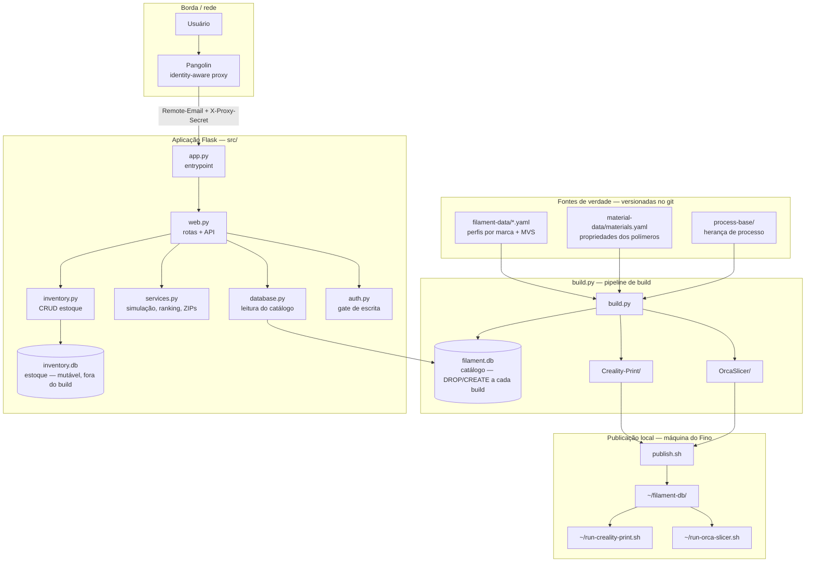
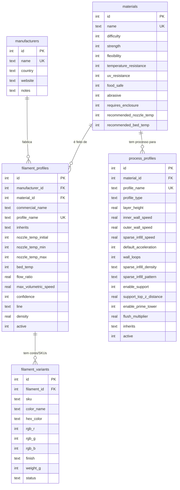
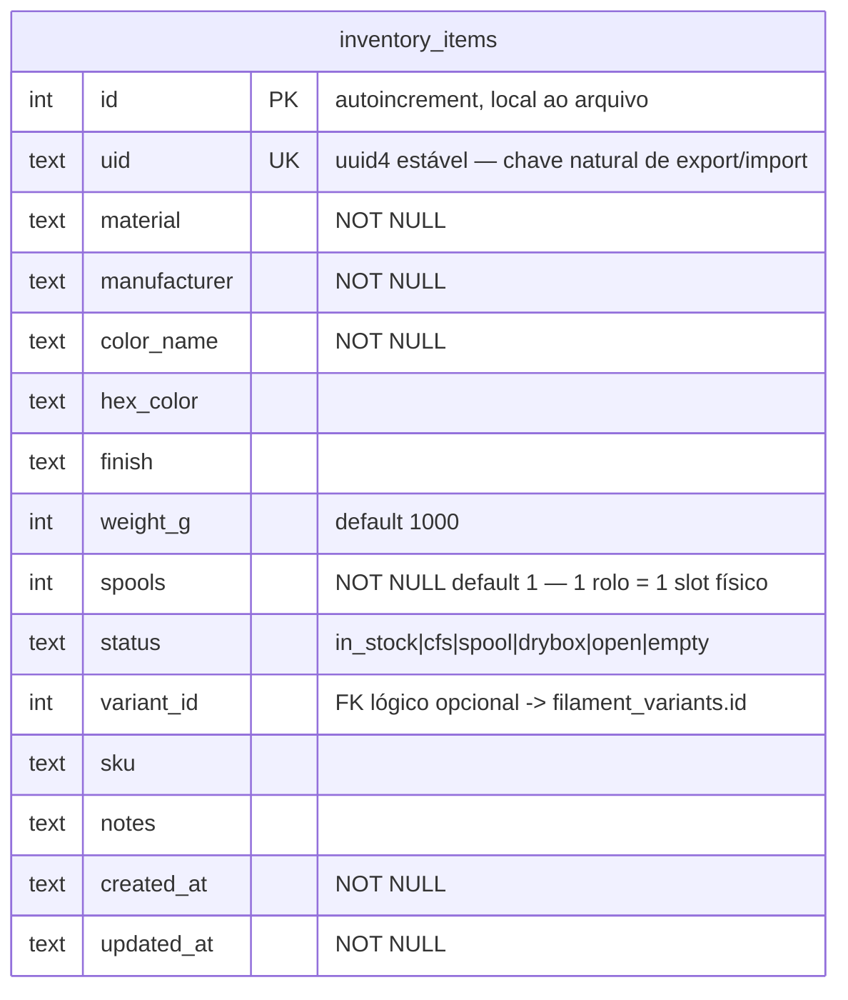
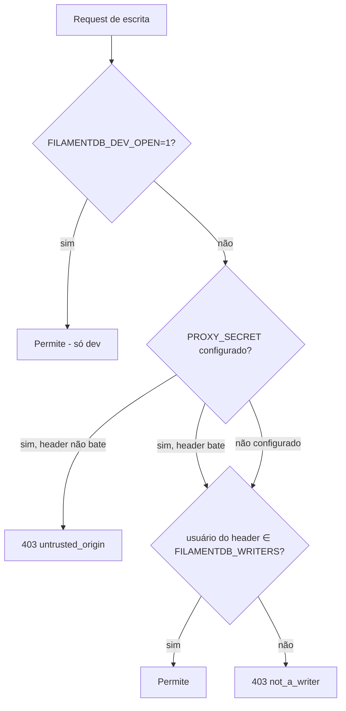
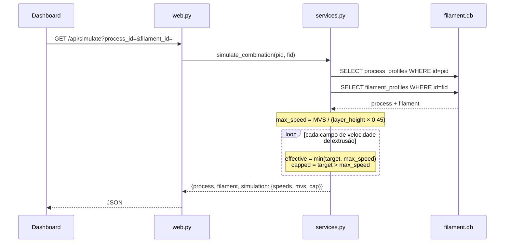
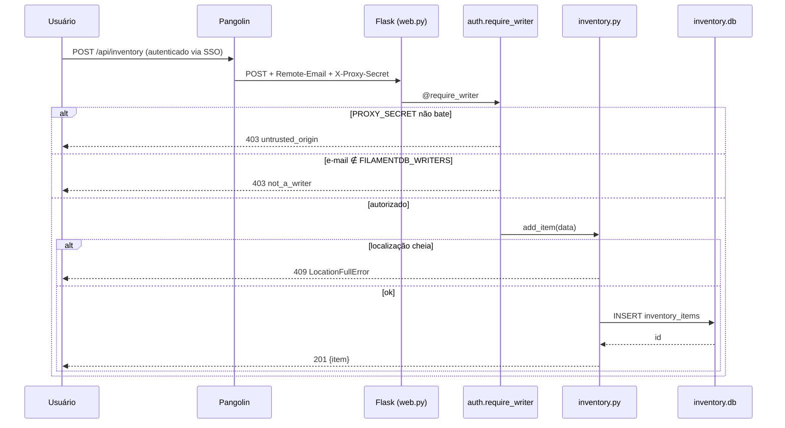
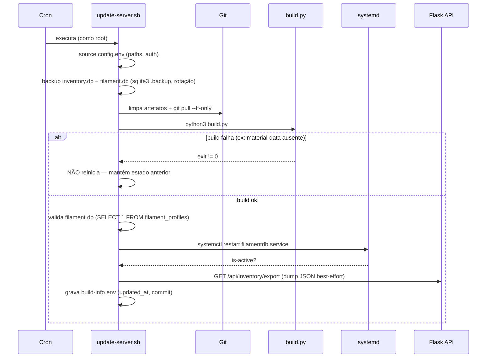
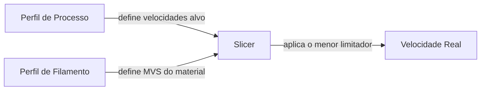
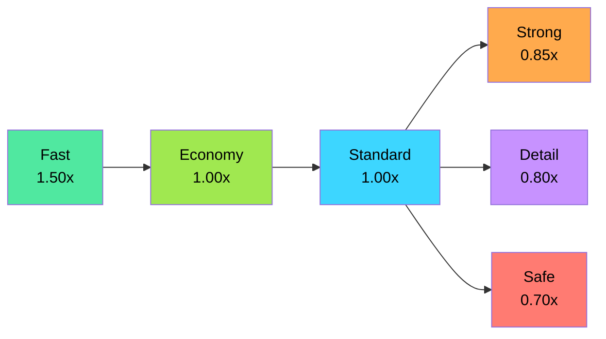
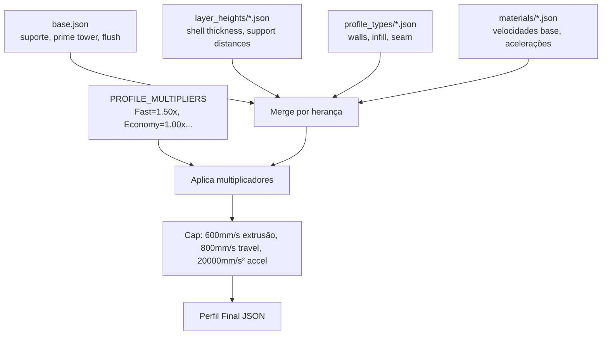

# FilamentDB

Sistema de gestão de perfis de impressão 3D e controle de estoque de filamentos, focado na **Creality K2** (CoreXY, Direct Drive, nozzle 0.4mm) com **Creality Print 7.0** e **Orca Slicer**.

O FilamentDB tem dois lados complementares:

1. **Geração de perfis** — um pipeline (`build.py`) que transforma dados declarativos (YAML/JSON) em perfis de filamento e processo prontos para importar nos slicers, com separação estrita entre "o que a máquina consegue" e "o que o material aguenta".
2. **Aplicação web** — um servidor Flask que serve um dashboard, uma API de catálogo (só leitura), um simulador de combinações processo × filamento e um **controle de estoque** de rolos (única parte com escrita), protegido por autorização atrás do Pangolin.

## Índice

- [Visão geral da arquitetura](#visão-geral-da-arquitetura)
- [Modelo de dados](#modelo-de-dados)
  - [`filament.db` — catálogo (regenerável)](#filamentdb--catálogo-regenerável)
  - [`inventory.db` — estoque (mutável)](#inventorydb--estoque-mutável)
- [Controle de estoque](#controle-de-estoque)
- [Autenticação, autorização e o Pangolin na frente](#autenticação-autorização-e-o-pangolin-na-frente)
- [API HTTP](#api-http)
- [Diagramas de sequência](#diagramas-de-sequência)
- [Configuração (`config.env`)](#configuração-configenv)
- [Deploy com `update-server.sh`](#deploy-com-update-serversh)
- [Health checks](#health-checks)
- [Desenvolvimento local](#desenvolvimento-local)
- [Formação dos perfis (decisões técnicas)](#formação-dos-perfis-decisões-técnicas) — a parte "core" do projeto

---

## Visão geral da arquitetura

O projeto é **100% Python/Flask**, sem containers. O deploy em produção é `git pull` + rebuild do banco + `systemctl restart`, orquestrado por `update-server.sh` (cron). Na frente do Flask fica o **Pangolin** (reverse proxy identity-aware), que termina TLS e injeta a identidade do usuário via header.



Componentes de código (`src/`):

| Módulo | Responsabilidade |
|--------|------------------|
| `app.py` | Entrypoint Flask. Carrega `config.env`, garante `inventory.db` no startup (`init_db()`), registra rotas. |
| `config.py` | Carregador leve de `config.env` (KEY=VALUE). Fonte única de verdade de paths/porta/auth. Precedência: ambiente > `config.env` > defaults. |
| `web.py` | Todas as rotas HTTP (páginas, API de catálogo, simulação, downloads e estoque). |
| `database.py` | Acesso somente-leitura ao `filament.db` (catálogo). Monta as árvores do dashboard. |
| `services.py` | Lógica de negócio: simulador de velocidades efetivas, ranking de combinações, geração de ZIPs Creality/Orca. |
| `inventory.py` | Controle de estoque: schema, CRUD, capacidade de localizações, export/import versionado. |
| `auth.py` | Gate de escrita (RBAC de dois níveis) baseado no header do Pangolin. |
| `buildinfo.py` | Lê o `build-info.env` (data/commit da última atualização) escrito pelo `update-server.sh`. |

**Dois bancos, propósitos opostos** — a decisão central da persistência:

- `filament.db` é **descartável**: `build.py` faz `DROP + CREATE` a cada execução. Não é versionado; é regenerado no deploy. Contém apenas dado derivado dos YAMLs.
- `inventory.db` é **precioso**: é o único dado mutável do usuário (rolos físicos). Nunca é tocado pelo build. É materializado on-demand com `CREATE TABLE IF NOT EXISTS` e migrado por `ALTER TABLE` no startup.

Separar os dois evita a classe inteira de bugs "o rebuild apagou meu estoque".

---

## Modelo de dados

### `filament.db` — catálogo (regenerável)

Gerado por `build.py` a partir de `filament-data/*.yaml` (filamentos), `material-data/materials.yaml` (propriedades dos polímeros) e `process-base/` (herança de processo). `PRAGMA foreign_keys = ON`.



Notas sobre as tabelas:

- **`manufacturers`** — fabricantes de filamento. `name` é único. Todos entram no banco; só um subconjunto (Voolt3D, Sunlu, Creality) é *exportado* para os slicers.
- **`materials`** — propriedades canônicas do polímero (não da marca). Vêm de `material-data/materials.yaml`. `difficulty` é derivado como `100 - confidence_base`. Cobre PLA, PETG, ABS, ASA, TPU e os CF (PLA-CF, PETG-CF), inclusive os que só existem em processo.
- **`filament_profiles`** — o perfil de filamento em si. `profile_name` é único no formato `"Material - Fabricante - Linha"` (ex.: `PLA - Voolt3D - Velvet`). O campo crítico é `max_volumetric_speed` (MVS): é ele que o slicer usa para capar velocidade em runtime. `confidence` (0-100) é **derivado** de fatores objetivos (maturidade do polímero + bônus de marca de uso corrente + riqueza de datasheet), não de nota subjetiva. `inherits` aponta para o perfil built-in do Creality Print.
- **`filament_variants`** — cada cor/SKU de um perfil (paleta). Tem cor (`hex_color` + RGB), acabamento (`finish`), peso e status.
- **`process_profiles`** — os perfis de processo gerados por herança. `profile_name` único no formato `"0.20mm Standard @Creality K2 0.4 nozzle - PLA"`. Guarda o conjunto completo de velocidades, acelerações, estrutura (walls/infill), suporte, seam, prime tower e flush. Ver [formação dos perfis](#formação-dos-perfis-decisões-técnicas).

Índices: `idx_filament_material`, `idx_filament_manufacturer`, `idx_variant_filament`, `idx_process_material`, `idx_process_type`.

### `inventory.db` — estoque (mutável)

Banco separado, com uma única tabela. Criado on-demand por `inventory.init_db()` (idempotente, migra por `ALTER TABLE`).



Pontos de design:

- **`id` vs `uid`** — `id` é autoincrement e local ao arquivo `.db`. `uid` (uuid4) é o identificador **estável** do rolo físico: sobrevive a export/import e à recriação do banco. É a chave natural do upsert na importação, com índice `UNIQUE`. Itens de bancos antigos recebem `uid` via backfill idempotente no `init_db()`.
- **`variant_id`** é referência lógica opcional ao catálogo (`filament_variants`). Não há FK forte porque os bancos são fisicamente separados — um item de estoque pode ser totalmente manual.
- Índices: `idx_inv_material`, `idx_inv_status` e o `UNIQUE idx_inv_uid`.

**Export/import versionado** (`INVENTORY_SCHEMA_VERSION = 1`): o estoque é exportável como envelope JSON desacoplado do schema físico:

```json
{ "schema_version": 1, "exported_at": "<iso8601>", "count": 3, "items": [ /* campos de _EXPORT_FIELDS */ ] }
```

O import faz **upsert idempotente por `uid`**: reimportar o mesmo envelope não duplica. `replace=true` ativa modo espelho (remove itens ausentes do payload). `_migrate_item()` é o ponto único de evolução para futuras versões de schema. O import **não** aplica validação de capacidade (está restaurando um estado que já era válido).

---

## Controle de estoque

O estoque modela onde cada rolo está fisicamente, refletindo o hardware da K2. É a única parte do sistema com escrita.

**Status / localização** (`inventory.py`):

| Status | Significado | Limite |
|--------|-------------|--------|
| `in_stock` | Guardado, lacrado | — |
| `cfs` | Carregado no CFS (Creality Filament System) | **4 slots** |
| `spool` | Drybox acoplado ao spool holder (5ª entrada) | **1** |
| `drybox` | Drybox guardado/seco (armazenamento) | — |
| `open` | Aberto, fora de CFS/drybox — **ALERTA** (exposto à umidade) | — |
| `empty` | Usado (vazio) | — |

**Capacidade física** — a K2 tem 4 baias no CFS + 1 posição no spool holder = 5 entradas ativas. Cada rolo (`spools`) ocupa **1 slot físico** independente da cor (o CFS troca de rolo automaticamente quando um acaba). `add_item`/`update_item` validam a capacidade e levantam `LocationFullError` (HTTP 409) ao exceder. A soma usa `SUM(spools)`, não contagem de itens.

**Operações**:
- `add_item` / `update_item` / `delete_item` — CRUD com validação de capacidade.
- `use_item(amount)` — decrementa rolos; ao zerar, marca `empty` automaticamente (botão "usei").
- `grouped_by_location()` — organiza na ordem do fluxo de uso: `printer` (CFS → spool) → `drybox` → `open` → `sealed` → `empty`.
- `grouped_by_material()` — paleta de cores por material (na K2 não se mistura material numa peça, então a paleta é sempre consultada dentro de um material).

Itens `empty` são excluídos das estatísticas agregadas (já foram consumidos).

---

## Autenticação, autorização e o Pangolin na frente

O FilamentDB **não implementa login**. A identidade é responsabilidade do **Pangolin**, um reverse proxy identity-aware posicionado na frente do Flask. O Pangolin autentica o usuário (SSO/OIDC) e injeta a identidade em um header (`Remote-Email` por padrão; também envia `Remote-User`, `Remote-Name`, `Remote-Role`). O Flask apenas *confia* nesse header — dentro dos limites descritos abaixo.

### Modelo RBAC de dois níveis

`auth.py` implementa um gate binário: **`writer`** (pode escrever) vs **`viewer`** (só lê). A **leitura é sempre aberta** — todo o catálogo e a visualização do estoque são públicos para quem chegou ao Flask. Só a **escrita** de estoque é protegida (todos os endpoints de mutação usam o decorator `@auth.require_writer`).

Controlado pela feature flag `FILAMENTDB_AUTH_ENABLED`:
- **Desligada (default)**: sistema aberto, usuário reportado como `guest`, escrita liberada.
- **Ligada**: escrita exige que o e-mail do header case com a allowlist `FILAMENTDB_WRITERS` (CSV).

### Precedência de decisão em escrita (flag ON)



O gate é **fail-closed**: se o segredo do proxy está configurado e não bate, nega antes mesmo de checar a allowlist.

### Aviso de segurança (importante)

Headers HTTP são **forjáveis**. Esse gate só é seguro se:

1. O Flask **não** for alcançável fora do proxy (bind interno / rede isolada), **e**
2. Houver um segredo compartilhado proxy↔Flask (`FILAMENTDB_PROXY_SECRET`), enviado no header `X-Proxy-Secret`.

Se `FILAMENTDB_PROXY_SECRET` está vazio, o Flask **não consegue verificar a origem** e a autorização é apenas cosmética (qualquer um que alcance o Flask e conheça um e-mail da allowlist pode escrever). Ver o aviso de segurança no cabeçalho de `src/auth.py`.

`GET /api/me` expõe `{ "user", "can_write", "auth_enabled" }` para a UI decidir se mostra os botões de escrita.

---

## API HTTP

Todas as rotas de leitura são abertas. As rotas marcadas com 🔒 exigem `writer` (quando a auth está ligada).

**Catálogo (leitura)**
| Método | Rota | Descrição |
|--------|------|-----------|
| GET | `/manufacturers` | Lista fabricantes |
| GET | `/materials` | Lista materiais |
| GET | `/api/filaments` | Lista filamentos (resumo) |
| GET | `/filament-profiles`, `/filament-profiles/<id>` | Perfis de filamento |
| GET | `/api/process-profiles`, `/api/process-profiles/<id>` | Perfis de processo |
| GET | `/api/tree`, `/api/process-tree` | Árvores para o dashboard |

**Simulação e ranking**
| Método | Rota | Descrição |
|--------|------|-----------|
| GET | `/api/simulate?process_id=&filament_id=` | Velocidades efetivas de uma combinação (aplica o cap MVS) |
| GET | `/api/simulation-options` | Processos e filamentos disponíveis |
| GET | `/api/ranking` | Ranking de todas as combinações (score de velocidade/acabamento/confiança) |

**Downloads (ZIP)**
| Método | Rota | Descrição |
|--------|------|-----------|
| GET | `/download/creality-print/<fabricante>/<material>` | ZIP de filamentos (Creality Print) |
| GET | `/download/process/<material>` | ZIP de processos (Creality Print) |
| GET | `/download/orca/filament/<fabricante>/<material>` | ZIP de filamentos (Orca) |
| GET | `/download/orca/process/<material>` | ZIP de processos (Orca) |

**Estoque**
| Método | Rota | Descrição |
|--------|------|-----------|
| GET | `/api/inventory` | Estoque por localização física |
| GET | `/api/inventory/by-material` | Estoque por material (paletas) |
| GET | `/api/inventory/items`, `/api/inventory/<id>` | Lista plana / item |
| GET | `/api/inventory/export` | Dump lógico versionado (backup) |
| POST 🔒 | `/api/inventory` | Cria item (409 se localização cheia) |
| PATCH 🔒 | `/api/inventory/<id>` | Atualiza item |
| POST 🔒 | `/api/inventory/<id>/use` | Marca uso (decrementa rolos) |
| DELETE 🔒 | `/api/inventory/<id>` | Remove item |
| POST 🔒 | `/api/inventory/import?replace=` | Importa envelope (upsert por uid) |

**Identidade / infra**
| Método | Rota | Descrição |
|--------|------|-----------|
| GET | `/api/me` | Identidade + permissão do request |
| GET | `/api/build-info` | Data/commit da última atualização |
| GET | `/health`, `/health/ready` | Liveness / readiness |

---

## Diagramas de sequência

### Simulação de uma combinação processo × filamento

O simulador reproduz o que o slicer faz em runtime: aplica o cap volumétrico do filamento sobre as velocidades do processo.



### Escrita no estoque com auth ligada



### Deploy noturno (`update-server.sh` via cron)



---

## Configuração (`config.env`)

`config.py` é a fonte única de verdade, compartilhada por app Flask, `build.py`, scripts shell (`source config.env`) e systemd (`EnvironmentFile`). Precedência: **ambiente do processo > `config.env` > defaults do código**.

`config.env` **não** é versionado (contém a allowlist e paths específicos da máquina). Copie de `config.env.example`:

```bash
cp config.env.example config.env
```

| Variável | Default | Função |
|----------|---------|--------|
| `FILAMENT_DB_PATH` | `<root>/filament.db` | Banco de catálogo (regenerável) |
| `FILAMENT_INVENTORY_DB_PATH` | `<root>/inventory.db` | Banco de estoque (mutável) |
| `FILAMENTDB_BACKUP_DIR` | `<root>/backups` | Backups (binário + dump JSON), com rotação |
| `FILAMENTDB_BUILD_INFO_PATH` | `<root>/build-info.env` | Data/commit da última atualização |
| `PORT` | `5000` | Porta HTTP |
| `FILAMENTDB_AUTH_ENABLED` | `0` | Feature flag de autorização de escrita |
| `FILAMENTDB_WRITERS` | *(vazio)* | Allowlist de e-mails que podem escrever (CSV) |
| `FILAMENTDB_IDENTITY_HEADER` | `Remote-Email` | Header de identidade injetado pelo Pangolin |
| `FILAMENTDB_PROXY_SECRET` | *(vazio)* | Segredo compartilhado proxy↔Flask (defesa contra header forjado) |
| `FILAMENTDB_DEV_OPEN` | `0` | Libera escrita em dev mesmo com auth ligada — **nunca em produção** |

---

## Deploy com `update-server.sh`

Deploy em produção não usa Docker. É um repositório em `/srv/FilamentDB` servido por `filamentdb.service` (systemd), atualizado por `scripts/update-server.sh` rodando via cron.

```bash
# cron (como root)
sudo crontab -e
0 4 * * * /srv/FilamentDB/scripts/update-server.sh >> /var/log/filamentdb-update.log 2>&1

# execução manual
sudo /srv/FilamentDB/scripts/update-server.sh
```

O script roda como root (precisa de `systemctl restart`) e executa, em ordem, com `set -euo pipefail`:

1. **Carrega `config.env`** — garante que backup e serviço usem exatamente os mesmos paths.
2. **Sanidade da auth** — se `FILAMENTDB_AUTH_ENABLED` está ligada mas `FILAMENTDB_WRITERS` está vazia, alerta (ninguém poderia escrever), sem bloquear.
3. **Backup dos bancos** — `sqlite3 .backup` (cópia consistente mesmo com o serviço ativo; fallback `cp`). Inventário primeiro (dado insubstituível). Rotação mantém os últimos `MAX_DB_BACKUPS` (30).
4. **Limpeza + `git pull --ff-only origin main`** — remove `filament.db` (regenerável) antes do pull para garantir fast-forward limpo.
5. **Instala os units systemd do repo** — `filamentdb.service` e `filamentdb-api.service` são copiados de `systemd/` para `/etc/systemd/system/` (deploy self-healing: um servidor novo recebe as units pelo próprio pull).
6. **Normaliza o dono para `${FILAMENTDB_RUN_USER}`** (default `fino`) — `chown -R` no repositório. O deploy roda como root, mas os dois serviços e os bancos operam como esse usuário; sem isso o `git pull`/`build` deixariam tudo `root:root` e a API (`User=fino`) falharia ao escrever em `price-history.db`.
7. **`python3 build.py`** — regenera o catálogo. Se falhar (ex.: `material-data/materials.yaml` ausente), **aborta sem reiniciar**, deixando o serviço no estado anterior em vez de subir quebrado.
8. **Validação do banco** — `SELECT 1 FROM filament_profiles` antes de reiniciar. Barreira final contra "no such table".
9. **Importa snapshots de preços** — `import_price_data.py` projeta `data/price-data/*.json` em `price-history.db` (idempotente).
10. **Renormaliza o dono** — build e import rodaram como root e recriaram bancos; novo `chown -R` antes de subir os serviços.
11. **`systemctl restart`** de ambos os serviços + verificação `is-active` e health/ready da API.
12. **Dump JSON do estoque** — `GET /api/inventory/export` via `curl` (best-effort, após o serviço subir), com rotação própria. Complementa o backup binário.
13. **Grava `build-info.env`** — só no fim: se qualquer etapa abortou, o arquivo reflete a última atualização *bem-sucedida* anterior. A UI lê via `/api/build-info`.

A robustez do script vem de fazer backup **antes** de qualquer alteração e de nunca reiniciar com banco inválido.

> **Modelo de usuário:** ambos os serviços (`filamentdb.service` e `filamentdb-api.service`) rodam como `fino` (configurável via `FILAMENTDB_RUN_USER`/`FILAMENTDB_RUN_GROUP` no `config.env`). Como escrevem nos mesmos bancos em `data/`, precisam ser o mesmo usuário — misturar root e `fino` causa `PermissionError` na ingestão de preços. Nunca rode `run.sh`, `build.py` ou `run-price-pipeline.sh` com `sudo`: isso deixa artefatos `root:root` e quebra os serviços.

---

## Health checks

Dois endpoints, seguindo a distinção liveness/readiness:

| Endpoint | Tipo | O que checa | Status |
|----------|------|-------------|--------|
| `GET /health` | Liveness | Só se o processo Flask responde. Não toca em disco. | Sempre `200` enquanto o worker atende |
| `GET /health/ready` | Readiness | Probe de leitura (`SELECT 1`) em `filament.db` e `inventory.db` | `200` se ambos ok, `503` se qualquer um falhar |

```json
{
  "status": "ok",
  "checks": {
    "filament_db":  {"status": "ok", "path": "...filament.db",  "latency_ms": 0.26},
    "inventory_db": {"status": "ok", "path": "...inventory.db", "latency_ms": 0.12}
  }
}
```

Um `.db` vazio abre sem erro mas falha no primeiro `SELECT` — por isso o probe roda uma query real, não só abre a conexão. O [Pangolin](https://docs.pangolin.net/manage/resources/public/healthchecks-failover) faz polling em `/health/ready` e tira o target de rotação pelo **status code** quando o banco cai. Config recomendada: path `/health/ready`, expected `200`, timeout `2s`, healthy/unhealthy interval `30s`/`5s`, thresholds `2`/`3` (evita flapping).

---

## Desenvolvimento local

```bash
# Sobe o servidor (cria venv, instala deps, rebuild do banco se preciso)
./run.sh

# Pipeline padrão de perfis: build + publish local
./publish.sh

# Apenas build (sem publish)
python3 build.py
python3 build.py --only-db       # só o banco
python3 build.py --only-export   # só export (banco já existe)

# Abrir os slicers (sync local + launch)
~/run-creality-print.sh
~/run-orca-slicer.sh
```

`run.sh` reconstrói o banco se ele estiver ausente **ou** inválido (não basta o arquivo existir). `publish.sh` faz backup automático em `~/filament-db/backups/` (zip com timestamp, últimos 10) antes de sobrescrever.

**Requisitos**: Python 3.9+, Flask, PyYAML (`requirements.txt`).

**Estrutura do projeto**:

```
FilamentDB/
├── filament-data/           # YAMLs de filamentos (fonte de verdade)
├── material-data/           # materials.yaml — propriedades dos polímeros (obrigatório)
├── process-base/            # sistema de herança de processos
│   ├── base.json            # config base (suporte, prime tower, flush)
│   ├── combinations.json    # quais perfis gerar
│   ├── layer_heights/       # override por layer height
│   ├── materials/           # velocidades alvo por material
│   └── profile_types/       # estrutura por profile type
├── src/                     # aplicação Flask
├── templates/ static/       # dashboard web
├── Creality-Print/          # output exportado (.json + .info)
├── OrcaSlicer/              # output exportado (.json)
├── scripts/update-server.sh # deploy (git pull + build + restart)
├── build.py                 # pipeline unificado
├── publish.sh  run.sh       # publicação local / servidor de dev
└── config.env.example
```

---

# Formação dos perfis (decisões técnicas)

Esta é a parte central do projeto: como os perfis são calculados e por quê.

## Filosofia: Separação de Responsabilidades



| Componente | Responsabilidade | Exemplo |
|------------|------------------|---------|
| **Perfil de Processo** | Velocidades alvo da *impressora* + estrutura da peça | 600 mm/s inner wall no Fast |
| **Perfil de Filamento** | Limite de fluxo do *material* (`filament_max_volumetric_speed`) | Voolt3D Velvet: 25 mm³/s |
| **Slicer** | Combina os dois em runtime, aplica o menor limitador | `max_speed = MVS / (layer_height × line_width)` |

### Por que essa abordagem?

Perfis de processo que limitam velocidades com base no material penalizam filamentos premium. Um PLA Silk (MVS=12) e um PLA High Speed (MVS=25) teriam o mesmo perfil de processo, mas capacidades completamente diferentes.

Com a separação:
- O perfil de processo define o **potencial máximo da máquina** para cada profile type
- O filamento define o **limite real do material**
- Filamentos premium aproveitam 100% da K2 (600mm/s), filamentos lentos são contidos automaticamente sem configuração extra

### Por que Standard e Strong não são lentos?

A K2 tem **Input Shaping** (compensação de vibração) e estrutura **CoreXY rígida**. Isso significa que imprimir a 450mm/s e 300mm/s produz qualidade visual praticamente idêntica nas inner walls. A diferença real entre perfis vem da **estrutura** (mais walls, mais infill), não da velocidade baixa.

- **Strong a 382mm/s** produz peças tão resistentes quanto Strong a 200mm/s — a resistência vem dos 6 walls e 50% infill, não da velocidade
- **Standard a 450mm/s** com input shaping tem acabamento equivalente a 300mm/s sem input shaping
- Reduzir velocidade só faz sentido se houver ganho mensurável de qualidade — na K2 com input shaping, esse ganho é mínimo acima de ~150mm/s

O leve conservadorismo no Strong (0.85x em vez de 1.0x) existe para dar mais tempo de cooling entre layers grossos (6 walls + 50% infill geram muito calor localizado), não por limitação mecânica.

### Racional de Velocidades — Empurrando os Limites da K2

A Creality K2 é especificada para **600 mm/s** de velocidade de impressão e **800 mm/s** de travel. Os perfis de processo definem velocidades que empurram esses limites mecânicos. A proteção real vem do MVS do filamento:

```
velocidade_real = min(velocidade_processo, MVS / (layer_height × line_width))
```

Para 0.20mm layer height e 0.45mm line width:

| Filamento | MVS | Velocidade máxima real |
|-----------|-----|----------------------|
| Voolt3D Velvet | 25 mm³/s | **277 mm/s** |
| Creality Hyper PLA | 23 mm³/s | **255 mm/s** |
| Sunlu High Speed | 22 mm³/s | **244 mm/s** |
| Voolt3D Standard | 20 mm³/s | **222 mm/s** |
| Sunlu PLA+ | 15 mm³/s | **166 mm/s** |
| CR-PLA genérico | 12 mm³/s | **133 mm/s** |

Se o processo pede 600mm/s mas o filamento aguenta 277mm/s, o slicer reduz automaticamente. Filamentos premium aproveitam o máximo que conseguem, filamentos budget são protegidos sem penalizar os demais.

## Hierarquia de Perfis de Processo



| Profile Type | Foco | Walls | Infill | Seam | Speed × | Accel × | Quality × |
|--------------|------|-------|--------|------|---------|---------|-----------|
| **Fast** | Velocidade máxima | 3 | 12% grid | nearest | 1.50 | 1.50 | — |
| **Economy** | Economia de filamento | 2 | 8% grid | nearest | 1.00 | 1.00 | — |
| **Standard** | Equilíbrio geral | 4 | 15% gyroid | aligned | 1.00 | 1.00 | — |
| **Strong** | Resistência mecânica | 6 | 50% gyroid | aligned | 0.85 | 0.80 | — |
| **Detail** | Qualidade visual (0.08-0.16mm) | 5 | 20% gyroid | back | 0.80 | 0.75 | 0.30 |
| **Safe** | Ultra-conservador | 4 | 18% gyroid | back | 0.70 | 0.60 | 0.50 |

**Quality ×** se aplica apenas a `outer_wall_speed`, `top_surface_speed`, `initial_layer_speed` e `gap_infill_speed` — campos que afetam diretamente a qualidade visual ou confiabilidade. Todos os outros campos (inner wall, infill, travel, support) usam o Speed × regular, permitindo imprimir rápido onde não importa. Esses multiplicadores estão em `build.py` → `PROFILE_MULTIPLIERS`.

### Materiais Especiais (apenas 0.20mm Standard)

| Material | Inner Wall | Outer Wall | Infill | Top Surface | Travel | Aceleração |
|----------|-----------|-----------|--------|-------------|--------|-----------|
| **ABS** | 300 | 200 | 300 | 180 | 550 | 12000 |
| **PLA-CF** | 280 | 180 | 300 | 160 | 500 | 10000 |
| **PETG-CF** | 240 | 160 | 260 | 140 | 450 | 9000 |
| **TPU** | 120 | 80 | 150 | 80 | 300 | 4000 |

## Velocidades Base por Material — Racional

As velocidades base representam o alvo **Standard** (multiplier 1.0x) para cada material. Não há penalização dupla — cada material tem velocidades calibradas diretamente para a K2:

| Material | inner_wall | outer_wall | infill | Racional |
|----------|-----------|-----------|--------|----------|
| **PLA** | 450 | 350 | 500 | K2 a pleno — MVS do filamento é o limitador real |
| **PETG** | 380 | 300 | 430 | Levemente conservador por cooling/stringing |
| **ABS** | 300 | 200 | 300 | Menor por warping — temperatura, não velocidade |
| **PLA-CF** | 280 | 180 | 300 | Rigidez da fibra + desgaste do nozzle |
| **PETG-CF** | 240 | 160 | 260 | Fibra + PETG — material mais difícil |
| **TPU** | 120 | 80 | 150 | Flexível — Direct Drive da K2 ajuda, mas tem limites |

**Importante**: `speed_multiplier` é 1.0 para todos os materiais. A diferença já está encodada nas velocidades base. Não há dupla penalização.

## Limites Físicos da Máquina (verificados no firmware)

| Parâmetro | Valor | Fonte |
|-----------|-------|-------|
| Velocidade máxima X/Y | **800 mm/s** | `machine_max_speed_x/y` no firmware |
| Velocidade máxima extrusão (print) | **600 mm/s** | Spec oficial Creality |
| Velocidade máxima motor E | **212 mm/s** | `machine_max_speed_e` no firmware |
| Aceleração máxima extrusão | **20000 mm/s²** | `machine_max_acceleration_extruding` |
| Aceleração máxima travel | **20000 mm/s²** | `machine_max_acceleration_travel` |
| Jerk X/Y | **100 mm/s** | `machine_max_jerk_x/y` |
| Tipo | CoreXY, Direct Drive | Input Shaping ativo |
| Nozzle | 0.4 mm | |
| Área | 260 × 260 × 260 mm | |

Os caps são aplicados em `build.py`: 600 mm/s para extrusão, 800 mm/s para travel, 20000 mm/s² para aceleração — depois de aplicar os multiplicadores.

## Defaults de Suporte e Multifilamento

Todos os perfis incluem por padrão:

| Configuração | Valor | Racional |
|--------------|-------|----------|
| `support_critical_regions_only` | 1 | Suporte apenas em regiões realmente necessárias |
| `support_type` | tree(auto) | Suporte em árvore — menos material, menos pontos de contato, fácil de remover |
| `support_on_build_plate_only` | 1 | Evita suporte sobre a peça |
| `support_xy_overrides_z` | z_overrides_xy | Prioriza distância Z (gap vertical) sobre XY |
| `enable_prime_tower` | 1 | Habilitada para multifilamento |
| `prime_tower_width` | 35 mm | Mínima funcional (padrão é 40) |
| `flush_multiplier` | 0.8 | Reduzido de 1.3 — sem problemas na prática |
| `flush_into_infill` | 1 | Usa infill como área de purga |
| `flush_into_support` | 1 | Usa suporte como área de purga |

### Suportes otimizados para remoção (especialmente PETG)

PETG tem alta adesão entre camadas — suportes com distâncias curtas fundem com a peça e são muito difíceis de remover. Os perfis usam valores otimizados para facilitar a remoção:

| Parâmetro | 0.20mm | 0.28mm | Por que |
|-----------|--------|--------|---------|
| `support_top_z_distance` | 0.25mm | 0.30mm | Gap vertical entre suporte e peça — evita fusão |
| `support_interface_spacing` | 0.8mm | 1.0mm | Espaçamento na interface — menos contato |
| `support_interface_top_layers` | 2 | 2 | Menos camadas de interface — descola mais fácil |
| `support_object_xy_distance` | 0.5mm | 0.55mm | Distância lateral — suporte não gruda nas paredes |

Esses valores funcionam bem tanto para PLA quanto PETG. PLA não precisa de tanto gap mas não é prejudicado por tê-lo. PETG é o material que mais beneficia desses ajustes.

## Combinações Geradas

```json
{
    "detail":    ["0.08", "0.12", "0.16", "0.20"] × [PLA, PETG],
    "standard":  ["0.20", "0.28"] × [PLA, PETG],
    "standard":  ["0.20"] × [TPU, ABS, PLA-CF, PETG-CF],
    "economy":   ["0.20"] × [PLA, PETG],
    "fast":      ["0.20", "0.28"] × [PLA, PETG],
    "strong":    ["0.20"] × [PLA, PETG],
    "safe":      ["0.20"] × [PLA, PETG]
}
```

Definido em `process-base/combinations.json`.

Racional:
- **Detail** cobre os layer heights de qualidade visual (0.08-0.20)
- **Standard 0.20** é o padrão de uso diário; **0.28** é draft rápido com qualidade aceitável
- **Economy** só em 0.20 — se quer rápido E barato, use Fast 0.28
- **Fast 0.20** = velocidade com qualidade; **Fast 0.28** = o mais rápido possível
- **Strong** só em 0.20 — resistência precisa de boa adesão entre layers
- **Safe** só em 0.20 — perfil de teste, sem variações
- **ABS, TPU, PLA-CF, PETG-CF** só em 0.20mm Standard

## MVS dos Filamentos Principais

| Filamento | MVS (mm³/s) | Cap @0.20mm | Cap @0.28mm |
|-----------|-------------|-------------|-------------|
| Voolt3D Velvet | 25 | 277 mm/s | 198 mm/s |
| Voolt3D PLA HS | 25 | 277 mm/s | 198 mm/s |
| Creality Hyper PLA | 23 | 255 mm/s | 182 mm/s |
| Sunlu PLA HS | 22 | 244 mm/s | 174 mm/s |
| Creality Hyper PETG | 23 | 255 mm/s | 182 mm/s |
| Voolt3D PLA Standard | 20 | 222 mm/s | 158 mm/s |
| Sunlu PLA Meta | 18 | 199 mm/s | 142 mm/s |
| Sunlu PLA+ | 15 | 166 mm/s | 119 mm/s |
| Creality CR PLA | 12 | 133 mm/s | 95 mm/s |
| Voolt3D PETG HF | 12 | 133 mm/s | 95 mm/s |
| Sunlu PETG | 12 | 133 mm/s | 95 mm/s |
| Voolt3D PETG CF | 10 | 111 mm/s | 79 mm/s |
| TPU 95A | 8-10 | 88-111 mm/s | 63-79 mm/s |

*Cap = MVS / (layer_height × 0.45)*

## Como o Pipeline de Perfis Funciona



**Ordem de merge**: `base.json` → `layer_heights/` → `profile_types/` → velocidades do material com multiplicadores aplicados. Campos de adesão (brim, altura da primeira camada) do `layer_heights/` têm precedência quando melhoram a adesão (brim mais largo, primeira camada mais grossa).

## Como Adicionar um Filamento

1. Edite ou crie um YAML em `filament-data/` (ex: `filament-data/nova_marca.yaml`)
2. Defina `max_volumetric_speed` para cada perfil (obrigatório — é o que limita velocidade no slicer)
3. Execute `python3 build.py && ./publish.sh --no-build`
4. Os perfis estarão em `~/filament-db/` prontos para ambos os slicers

## Como Ajustar Perfis de Processo

- `process-base/base.json` — configurações base compartilhadas (suporte, prime tower, flush)
- `process-base/layer_heights/` — ajustes por altura de camada (shell thickness, support distances)
- `process-base/profile_types/` — parâmetros estruturais (walls, infill, seam, brim)
- `process-base/materials/` — velocidades e acelerações base por tipo de material
- `process-base/combinations.json` — define quais combinações (tipo × altura × material) gerar
- `build.py` → `PROFILE_MULTIPLIERS` — multiplicadores de velocidade/aceleração por profile type

## Fabricantes Exportados

Apenas estes fabricantes são exportados para os slicers:

- Voolt3D
- Sunlu
- Creality

Os demais ficam no banco (`filament-data/`) para referência. Para incluir fabricantes extras temporariamente: `./publish.sh --add "Elegoo"` ou `./publish.sh --all`.

## Comandos

| Comando | O que faz |
|---------|-----------|
| `./run.sh` | Sobe o servidor de dev (venv + deps + build se preciso) |
| `./publish.sh` | Build + publish local |
| `./publish.sh --no-build` | Apenas copia (sem rebuild) |
| `./publish.sh --list` | Lista fabricantes disponíveis |
| `./publish.sh --add "Nome"` | Inclui fabricante extra |
| `./publish.sh --all` | Exporta todos os fabricantes |
| `python3 build.py` | Recria banco + exporta perfis (sem publish) |
| `python3 build.py --only-db` | Apenas recria o banco (sem export) |
| `python3 build.py --only-export` | Apenas exporta (banco já existe) |
| `~/run-creality-print.sh` | Sync perfis locais + abre Creality Print |
| `~/run-orca-slicer.sh` | Sync perfis locais + abre Orca Slicer |

## Price Intelligence

O FilamentDB possui um módulo de **inteligência de preços** separado do catálogo técnico. O objetivo é acompanhar oportunidades reais de compra de filamentos, preservar séries históricas e permitir comparação por material, fabricante, modelo, cor e loja.

### Objetivos e escopo

O monitoramento é **opt-in** por meio do campo `tracking` nos perfis de `filament-data/*.yaml`. No escopo atual, o foco é: **PLA e PETG**, priorizando linhas de maior qualidade, premium e acabamentos **Matte/Velvet**, das marcas de interesse.

Marcas prioritárias atuais:

- Voolt3D
- 3DLab
- F3D
- Sunlu
- eSUN
- Elegoo
- Creality

Fontes/lojas monitoradas ou planejadas:

- lojas oficiais da Voolt3D, 3DLab e F3D;
- Mercado Livre;
- Amazon.com;
- Shopee;
- AliExpress.

A lista de fontes é mantida em `data/price-sources.json`. Uma fonte pode estar cadastrada antes de existirem ofertas coletadas nela; **não se deve inventar uma oferta apenas porque a loja está monitorada**.

### Decisão arquitetural: identidade estável do filamento

O `id` inteiro de `filament_profiles` é um identificador técnico interno e **não deve ser usado como identidade persistente entre bancos**. O build pode recriar `filament.db`, portanto um `AUTOINCREMENT` não é uma identidade estável por si só.

A identidade lógica é `filament_key`, construída deterministicamente como:

```text
normalize(material) | normalize(manufacturer) | normalize(model)
```

A normalização:

1. converte para Unicode normalizado;
2. remove diacríticos/acentos;
3. converte para lowercase;
4. remove espaços nas extremidades;
5. colapsa sequências de espaços em um único espaço.

Exemplos:

```text
pla|elegoo|pla matte
pla|voolt3d|pla velvet
petg|f3d|petg premium
```

Essa chave é a identidade usada para correlacionar o catálogo regenerável com o banco persistente de preços. A ordem dos registros no build, inclusão de novos fabricantes ou reconstrução do banco não deve alterar essa identidade.

### Cor é variante, não identidade

A cor é relevante para compra, mas não faz parte da `filament_key`. Um mesmo filamento pode ter N variantes de cor:

```text
pla|elegoo|pla matte
├── Preto
├── Branco
├── Cinza
└── Vermelho
```

As variantes vivem em `filament_variants` no catálogo e uma oferta pode apontar para uma variante específica. Isso permite comparar a mesma cor entre diferentes lojas e manter uma única identidade para o modelo do filamento.

### Modelo de dados de preços

`data/price-history.schema.sql` define o banco persistente `price-history.db`. A separação é deliberada:

```text
filament.db (catálogo técnico, regenerável)
    │
    └── filament_key
             │
             ▼
price-history.db (histórico de preços, persistente)
    │
    ├── stores
    ├── offers
    │     └── filament_key + variant_id + store + URL
    ├── price_snapshots
    │     └── preço observado em uma data/hora
    └── collection_runs
          └── execução/coleta realizada
```

#### `stores`

Cadastro das fontes monitoradas. Campos principais: `name`, `domain`, `marketplace`.

#### `offers`

Representa uma oferta concreta e persistente. Uma oferta é identificada pela combinação de loja e URL (`UNIQUE(store_id, url)`) e possui:

- `filament_key` — identidade lógica do filamento;
- `variant_id` — cor/SKU quando identificável;
- `filament_id` — campo técnico legado/compatibilidade, não usar como identidade externa;
- `store_id`;
- `url` — **URL direta da oferta**, nunca somente a homepage da loja;
- `external_id`;
- `seller`;
- `title`;
- timestamps de primeira/última observação.

#### `price_snapshots`

Registra o preço observado sem sobrescrever o passado. Uma nova coleta adiciona um snapshot. Campos relevantes:

- `offer_id`;
- `collected_at`;
- `price`;
- `original_price`;
- `shipping`;
- `total_price`;
- `currency`;
- `available`;
- `coupon`;
- `source`;
- `notes`.

**O histórico nunca deve ser apagado para reconstruir um snapshot.**

#### `collection_runs`

Registra cada execução de coleta, sua fonte, status, período e quantidade de itens encontrados.

### Regra fundamental de associação

Uma oferta **nunca** deve ser associada a um filamento pela posição de um array, pelo `id` AUTOINCREMENT presumido ou por similaridade textual entre títulos. A associação deve resolver:

```text
oferta encontrada
    ↓
material + fabricante + modelo
    ↓
filament_key normalizada
    ↓
filament.db / filament_profiles
```

Se a correspondência não for inequívoca, a oferta deve ser descartada da carga ou ficar pendente de validação. É preferível ter menos dados a registrar uma oferta no filamento errado.

Esse princípio existe especificamente para impedir problemas como uma oferta de **Elegoo** aparecer associada a **Voolt3D** depois de uma reconstrução do catálogo.

### Regra para coleta de ofertas

Uma pesquisa pode encontrar várias ofertas para o mesmo filamento. **Todas as ofertas relevantes encontradas devem ser preservadas**, e não apenas a mais barata. O objetivo é construir massa de dados para:

- melhor preço atual;
- preço médio;
- mediana;
- mínimo/máximo histórico;
- evolução de preço;
- comparação entre lojas;
- comparação por cor;
- identificação de oportunidades.

Exemplo conceitual:

```text
Elegoo PLA Matte / Preto
├── Mercado Livre → R$ 139,90
├── Shopee        → R$ 125,40
└── Amazon        → R$ ...
```

Não se deve substituir uma oferta existente por outra apenas porque a nova é mais barata. A oferta é uma entidade; o preço é uma série temporal.

### Procedimento para um agente de coleta de preços

Este procedimento é parte da especificação funcional do projeto e deve ser seguido por qualquer agente (humano ou IA) responsável por alimentar o banco.

#### 1. Descobrir os perfis a monitorar

Ler `filament.db` e selecionar apenas `filament_profiles.tracking = 1`. Usar `filament_key`, material, fabricante e modelo como identidade.

Não assumir uma lista fixa de IDs. IDs podem mudar; `filament_key` é a referência estável.

#### 2. Pesquisar cada filamento

Para cada perfil, procurar ofertas relevantes nas fontes monitoradas. Priorizar:

1. loja oficial do fabricante;
2. Mercado Livre;
3. Amazon.com;
4. Shopee;
5. AliExpress;
6. outras fontes explicitamente autorizadas no futuro.

Pesquisar pelo fabricante + modelo + material e, quando aplicável, pela cor.

#### 3. Validar o produto

Antes de registrar uma oferta, confirmar que a página realmente corresponde ao filamento procurado. Validar, sempre que possível:

- fabricante;
- material;
- linha/modelo;
- diâmetro, normalmente 1,75 mm;
- peso, normalmente 1 kg;
- acabamento (Matte/Velvet/Premium etc.);
- cor;
- vendedor/loja;
- disponibilidade;
- preço e condições do preço.

Não confundir uma variante comum com uma linha premium/matte/velvet só porque o título contém palavras parecidas.

#### 4. Registrar a URL direta

Para ofertas que fazem sentido, armazenar a **URL direta da página do produto/anúncio**. Não registrar uma busca, homepage ou categoria como se fosse a oferta.

A URL deve permitir que o usuário abra exatamente o produto encontrado.

#### 5. Identificar a cor

Se a oferta for de uma cor específica, associá-la à variante correspondente. Se o anúncio oferecer várias cores, registrar as variantes somente quando houver evidência suficiente para saber que elas pertencem à mesma oferta/SKU ou registrar cada URL/SKU separadamente quando a loja tratar cada cor como uma oferta independente.

Não criar variantes apenas por inferência.

#### 6. Resolver a `filament_key`

Usar o catálogo como fonte de verdade. A chave deve ser resolvida a partir dos dados canônicos, nunca criada arbitrariamente pelo título do marketplace.

Se houver duas correspondências possíveis, **não carregar automaticamente**.

#### 7. Registrar a oferta

Criar ou atualizar `offers`. A mesma URL na mesma loja representa a mesma oferta e pode receber novos snapshots.

Nunca apagar uma oferta apenas porque ela não apareceu em uma coleta posterior; ela pode ter ficado indisponível temporariamente. Use `active`/`available` e os snapshots para representar o estado observado.

#### 8. Registrar o snapshot

Cada coleta deve registrar o preço observado em `price_snapshots`. Preservar:

- preço anunciado;
- preço original quando disponível;
- frete quando disponível;
- preço total quando puder ser calculado com segurança;
- moeda;
- disponibilidade;
- cupom/desconto;
- fonte da coleta;
- observações relevantes.

Não transformar desconto potencial em preço final sem evidência. Por exemplo, se a página diz "10% no Pix", registrar o preço efetivamente calculado apenas quando a condição estiver clara e manter a informação da condição em `notes`/campos apropriados.

#### 9. Não inventar dados

É proibido preencher preço, URL, cor, vendedor ou disponibilidade por estimativa. Se uma fonte não retornar uma oferta verificável, registrar a ausência da oferta, não uma URL genérica.

#### 10. Validar antes de persistir

Antes de finalizar uma coleta, verificar:

```text
manufacturer da oferta == manufacturer da filament_key
material da oferta == material da filament_key
model da oferta == model da filament_key
URL pertence à loja registrada
preço é numérico e está em BRL quando aplicável
cor, se informada, pertence ao filamento
```

Qualquer inconsistência deve impedir a associação silenciosa.

### Automação da coleta (GitHub Actions) — fluxo snapshot-first

A coleta diária roda no GitHub Actions (`.github/workflows/price-collector.yml`), **fora** do servidor de produção, no cron `30 6 * * *` (UTC) e também sob `workflow_dispatch`. O modelo é **snapshot-first**: o agente monta o snapshot completo primeiro, ele é validado offline, e só então publicado na API. Isso mantém o snapshot como fonte de verdade auditável e desacopla a coleta da disponibilidade da API.

```text
build.py --only-db            → data/filament.db (catálogo, tracking=1)
        ↓
collect_prices_agent.py       → data/price-data/YYYY-MM-DD.json (offers completas em memória → JSON)
        ↓
validate_price_snapshot.py    → valida identidade, URL, preço, peso, quantidade, total_price
        ↓
publish_price_snapshot.py     → POST /v1/ingest/prices (uma oferta por vez, dedupe na API)
        ↓
git commit + push             → snapshot versionado em main
```

Pontos importantes do contrato:

- O agente de IA usa a ferramenta `submit_offer` apenas para **acumular ofertas em memória** durante a coleta; ele **não** faz `POST` durante a pesquisa. A publicação é uma etapa posterior e explícita.
- Cada item de `offers` no snapshot é uma oferta **completa e autocontida** (`filament_key`, `store`, `url`, `title`, `price`, `currency`, `quantity`, `unit_weight_g`, `price_basis`, `total_price`), exatamente o que a API `/v1/ingest/prices` espera.
- A validação lê o catálogo em `data/filament.db` (o mesmo que o `build.py` gera). Não existe `filament.db` na raiz do projeto.
- Se a validação falhar, nada é publicado nem commitado. Se a publicação de qualquer oferta falhar, o workflow falha e o snapshot não é tratado como completo.
- **Reexecução no mesmo dia é idempotente**: se o snapshot do dia já existe, uma nova coleta faz *merge* com as ofertas anteriores, deduplicando por identidade (`loja|url|quantidade|peso|price_basis`) e mantendo a observação mais recente. Rodar N vezes só enriquece/atualiza o snapshot, nunca duplica nem perde ofertas. O input `replace=true` força recomeço do zero (descarta o snapshot do dia).

#### Providers de IA e resiliência

Os agentes usam a API compatível com OpenAI de cada provider. A ordem de tentativa é controlada por `PRICE_AGENT_PROVIDERS` (default: `groq,mistral,gemini`) — os provedores com cota gratuita funcional primeiro, deixando o **Gemini pré-pago como rede de segurança** no fim. Cada provider só é montado se sua chave existir; os ausentes são ignorados silenciosamente. As chaves são secrets do repositório, nunca compartilhadas com o servidor.

Os demais provedores da tabela abaixo (cerebras, z, openrouter, openai) continuam suportados no código, mas ficam fora do default porque exigem saldo/billing na conta para funcionar. Para reativá-los depois de recarregar, basta incluí-los na variável `PRICE_AGENT_PROVIDERS` do repositório — sem alterar código.

| Provider | Secret | Base URL | Modelo (var / default) |
|----------|--------|----------|------------------------|
| cerebras | `CEREBRAS_API_KEY` | `api.cerebras.ai/v1` | `CEREBRAS_PRICE_MODEL` / `gpt-oss-120b` |
| groq | `GROQ_API_KEY` | `api.groq.com/openai/v1` | `GROQ_PRICE_MODEL` / `openai/gpt-oss-20b` |
| mistral | `MISTRAL_API_KEY` | `api.mistral.ai/v1` | `MISTRAL_PRICE_MODEL` / `mistral-small-latest` |
| openai | `OPENAI_API_KEY` | `api.openai.com/v1` | `OPENAI_PRICE_MODEL` / `gpt-4o-mini` |
| openrouter | `OPENROUTER_API_KEY` | `openrouter.ai/api/v1` | `OPENROUTER_PRICE_MODEL` / `openai/gpt-4o-mini` |
| z | `Z_API_KEY` | `api.z.ai/api/paas/v4` | `ZAI_PRICE_MODEL` / `glm-4.6` |
| gemini | `GEMINI_API_KEY` | `generativelanguage.googleapis.com/v1beta/openai/` | `GEMINI_PRICE_MODEL` / `gemini-3.7-flash` |

Tratamento de falhas (para não perder a coleta inteira por um erro pontual):

- **Erros transitórios do LLM** (429 rate limit, 5xx, 413 tokens/min, timeout, tool-call malformado) são reto­mados com backoff (`PRICE_AGENT_LLM_RETRIES`, `PRICE_AGENT_LLM_BACKOFF`, `PRICE_AGENT_LLM_TIMEOUT`). Persistindo, viram `ProviderError` e o collector **cai para o próximo provider**. Erros permanentes (401/402/403/404) falham na hora, sem retry.
- **Busca web** usa `ddgs` com backends fixos e confiáveis no CI (`bing,brave,yandex,mojeek` por default, via `PRICE_AGENT_SEARCH_BACKENDS`) — google/duckduckgo/yahoo/wikipedia foram removidos por serem bloqueados/instáveis nos runners. Resultados são enxugados (5 itens, snippet ≤300 chars) para caber no orçamento de tokens/min de tiers gratuitos.
- Um provider que bate rate limit é **marcado como esgotado** e não é tentado de novo nos filamentos seguintes da mesma coleta (economiza tempo e cota).
- Se **todos** os providers falharem para um filamento, ele é registrado como `error` no `collection` e a coleta **continua** com os demais — o snapshot é salvo com o que foi obtido, em vez de abortar e perder tudo.
- Como a reexecução no mesmo dia faz merge idempotente, basta rodar o job de novo (após a cota resetar) para completar os filamentos que ficaram como `error`.

#### Segredos e variáveis do Actions

| Nome | Tipo | Uso |
|------|------|-----|
| `FILAMENTDB_API_SECRET` | secret | Mesmo valor de `FILAMENTDB_PROXY_SECRET` no servidor; header `X-Proxy-Secret` |
| `MISTRAL_API_KEY` | secret | Provider de IA primário |
| `GEMINI_API_KEY` | secret | Provider de IA de fallback |
| `FILAMENTDB_API_URL` | variable | URL pública da API (tem fallback no workflow) |
| `PRICE_AGENT_PROVIDERS` | variable (opcional) | Ordem dos providers, ex.: `mistral,gemini` |
| `PRICE_AGENT_MAX_TURNS` | variable (opcional) | Limite de ciclos de tool-calling por filamento |

#### Validação local antes do Actions

Para testar o pipeline sem depender do GitHub Actions, use o runner local:

```bash
# Pipeline completo local (build → collect → validate), sem publicar
./scripts/run-price-pipeline.sh

# Só um subconjunto de perfis, para iterar rápido
PRICE_AGENT_MAX_PROFILES=2 ./scripts/run-price-pipeline.sh

# Incluindo publicação na API (exige FILAMENTDB_API_SECRET e a API no ar)
./scripts/run-price-pipeline.sh --publish
```

O runner usa o `.venv` local, instala as dependências do collector se faltarem, e para no primeiro erro. Sem `MISTRAL_API_KEY`/`GEMINI_API_KEY` configuradas, a etapa de coleta é pulada e o runner valida o snapshot mais recente já existente.

### Banco de preços e Git

`price-history.db` é diferente de `filament.db`:

- `filament.db` é derivado e regenerável; não é a fonte de verdade;
- `price-history.db` contém dados históricos e **não deve ser apagado pelo build**;
- `price-history.db` é intencionalmente rastreável no Git para preservar o histórico junto ao projeto;
- seeds e schema ficam em `data/` e devem ser versionados;
- o histórico não deve ser reconstruído destrutivamente só porque o catálogo foi atualizado.

### Configuração de bancos

Não existe caminho hardcoded para `/srv/FilamentDB`. O caminho dos bancos deve ser resolvido por `src/config.py`, com `DB_PATH` como configuração central. Quando `DB_PATH` está ausente/vazio, usa-se o caminho local padrão definido pela configuração (dentro da solução). Isso permite executar a aplicação tanto no servidor quanto no computador de desenvolvimento.

Bancos diferentes devem permanecer organizados no mesmo diretório de dados definido pela configuração. Não criar bancos em diretórios espalhados pela aplicação.

### Build e estabilidade dos IDs

`build.py` pode recriar `filament.db`. Durante o build, IDs técnicos existentes são preservados quando o mesmo perfil já existe, mas essa preservação é uma conveniência de compatibilidade, **não substitui `filament_key` como identidade**.

O build também calcula a origem dos dados do catálogo para permitir que `run.sh` detecte mudanças e reconstrua o banco quando necessário.

### Interface de preços

A página de preços deve ser orientada à comparação, e não apenas a uma lista de cards. A ordenação padrão é:

```text
material
  → fabricante
    → modelo
```

Cada linha/grupo deve poder apresentar, quando houver dados:

- melhor preço atual;
- preço de referência/médio;
- quantidade de ofertas;
- quantidade de cores;
- loja da melhor oferta;
- link direto da oferta;
- detalhes por cor/loja.

Uma oferta de uma marca nunca deve aparecer em outro fabricante por causa da ordenação, índice do array ou cruzamento incorreto de dados. O backend deve entregar a identidade canônica (`filament_key`) junto da oferta e a UI deve usá-la como chave.

### Snapshot inicial e estado conhecido

O primeiro snapshot foi concebido como ponto de partida do histórico, não como catálogo completo. A intenção é aumentar progressivamente a massa de dados nas coletas seguintes.

Em 29/08/2026, o histórico inicial continha ofertas verificadas de 3D Lab, Creality, Elegoo, Voolt3D e Shopee/Mercado Livre, e posteriormente F3D foi incluída no conjunto monitorado. Esse snapshot deve ser tratado como **baseline histórico**, não como representação exaustiva do mercado.

### Evolução planejada

A evolução natural do módulo é:

1. aumentar a cobertura de ofertas por filamento;
2. coletar sistematicamente Amazon.com, Shopee e AliExpress;
3. coletar lojas oficiais de Voolt3D, 3DLab e F3D;
4. enriquecer variantes de cor;
5. acumular snapshots ao longo do tempo;
6. calcular médias, medianas e mínimos históricos;
7. identificar automaticamente oportunidades de compra;
8. gerar relatórios HTML com links diretos para as melhores ofertas.

O objetivo final é que a tela de preços responda não apenas "qual é o menor preço agora?", mas também **"este preço é realmente uma boa oportunidade em relação ao histórico?"**.
