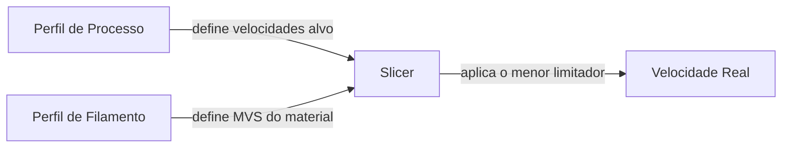
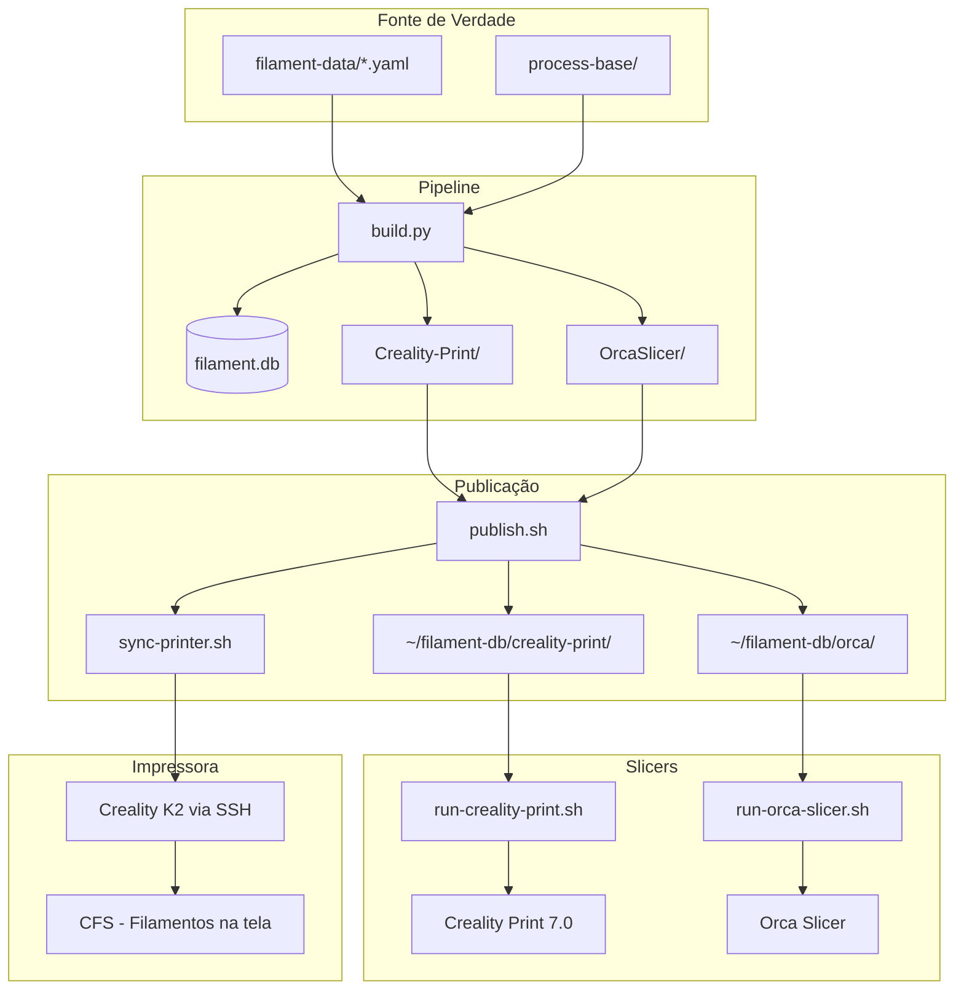
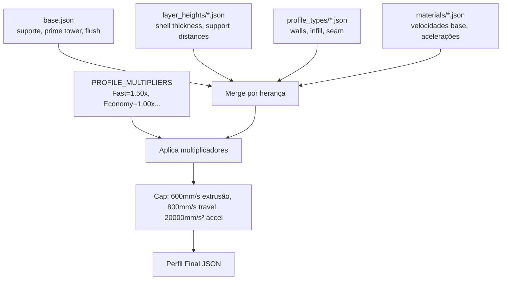

# FilamentDB

Banco de dados de perfis de filamentos e configurações de processo para impressoras 3D, focado na **Creality K2** com **Creality Print 7.0** e **Orca Slicer**.

## Filosofia: Separação de Responsabilidades



| Componente | Responsabilidade | Exemplo |
|------------|------------------|---------|
| **Perfil de Processo** | Velocidades alvo da *impressora* + estrutura da peça | 600 mm/s inner wall no Fast |
| **Perfil de Filamento** | Limite de fluxo do *material* (`filament_max_volumetric_speed`) | Voolt3D Velvet: 25 mm³/s |
| **Slicer** | Combina os dois em runtime, aplica o menor limitador | `max_speed = MVS / (layer_height × line_width)` |

### Por que essa abordagem?

Perfis de processo que limitam velocidades com base no material penalizam filamentos premium. Um PLA Silk (MVS=12) e um PLA High Speed (MVS=25) teriam o mesmo perfil de processo, mas capacidades completamente diferentes.

Com a separação:
- O perfil de processo define o **potencial máximo da máquina** para cada profile type
- O filamento define o **limite real do material**
- Filamentos premium aproveitam 100% da K2 (600mm/s), filamentos lentos são contidos automaticamente sem configuração extra

### Por que Standard e Strong não são lentos?

A K2 tem **Input Shaping** (compensação de vibração) e estrutura **CoreXY rígida**. Isso significa que imprimir a 450mm/s e 300mm/s produz qualidade visual praticamente idêntica nas inner walls. A diferença real entre perfis vem da **estrutura** (mais walls, mais infill), não da velocidade baixa.

- **Strong a 382mm/s** produz peças tão resistentes quanto Strong a 200mm/s — a resistência vem dos 6 walls e 50% infill, não da velocidade
- **Standard a 450mm/s** com input shaping tem acabamento equivalente a 300mm/s sem input shaping
- Reduzir velocidade só faz sentido se houver ganho mensurável de qualidade — na K2 com input shaping, esse ganho é mínimo acima de ~150mm/s

O leve conservadorismo no Strong (0.85x em vez de 1.0x) existe para dar mais tempo de cooling entre layers grossos (6 walls + 50% infill geram muito calor localizado), não por limitação mecânica.

### Racional de Velocidades — Empurrando os Limites da K2

A Creality K2 é especificada para **600 mm/s** de velocidade de impressão e **800 mm/s** de travel. Os perfis de processo definem velocidades que empurram esses limites mecânicos. A proteção real vem do MVS do filamento:

```
velocidade_real = min(velocidade_processo, MVS / (layer_height × line_width))
```

Para 0.20mm layer height e 0.45mm line width:

| Filamento | MVS | Velocidade máxima real |
|-----------|-----|----------------------|
| Voolt3D Velvet | 25 mm³/s | **277 mm/s** |
| Creality Hyper PLA | 23 mm³/s | **255 mm/s** |
| Sunlu High Speed | 22 mm³/s | **244 mm/s** |
| Voolt3D Standard | 20 mm³/s | **222 mm/s** |
| Sunlu PLA+ | 15 mm³/s | **166 mm/s** |
| CR-PLA genérico | 12 mm³/s | **133 mm/s** |

Se o processo pede 600mm/s mas o filamento aguenta 277mm/s, o slicer reduz automaticamente. Filamentos premium aproveitam o máximo que conseguem, filamentos budget são protegidos sem penalizar os demais.

## Hierarquia de Perfis de Processo


| Profile Type | Foco | Walls | Infill | Seam | Speed × | Accel × | Quality × |
|--------------|------|-------|--------|------|---------|---------|-----------|
| **Fast** | Velocidade máxima | 3 | 12% grid | nearest | 1.50 | 1.50 | — |
| **Economy** | Economia de filamento | 2 | 8% grid | nearest | 1.00 | 1.00 | — |
| **Standard** | Equilíbrio geral | 4 | 15% gyroid | aligned | 1.00 | 1.00 | — |
| **Strong** | Resistência mecânica | 6 | 50% gyroid | aligned | 0.85 | 0.80 | — |
| **Detail** | Qualidade visual (0.08-0.16mm) | 5 | 20% gyroid | back | 0.80 | 0.75 | 0.45 |
| **Safe** | Ultra-conservador | 4 | 18% gyroid | back | 0.70 | 0.60 | 0.50 |

**Quality ×** se aplica apenas a `outer_wall_speed`, `top_surface_speed` e `initial_layer_speed` — campos que afetam diretamente a qualidade visual ou confiabilidade. Todos os outros campos (inner wall, infill, travel, support) usam o Speed × regular, permitindo imprimir rápido onde não importa.

### Velocidades Resultantes — PLA (inner_wall / outer_wall / infill mm/s)

| Profile Type | Layer Height | Inner Wall | Outer Wall | Infill | Top Surface | Travel | Aceleração |
|--------------|-------------|-----------|-----------|--------|-------------|--------|-----------|
| **Fast** | 0.20 / 0.28 | 600 | 525 | 600 | 450 | 800 | 20000 |
| **Economy** | 0.20 | 450 | 350 | 500 | 300 | 700 | 18000 |
| **Standard** | 0.20 / 0.28 | 450 | 350 | 500 | 300 | 700 | 18000 |
| **Strong** | 0.20 | 382 | 297 | 425 | 255 | 595 | 14400 |
| **Detail** | 0.08-0.16 | 360 | 157 | 400 | 135 | 560 | 13500 |
| **Safe** | 0.20 | 315 | 175 | 350 | 150 | 490 | 10800 |

### Velocidades Resultantes — PETG (inner_wall / outer_wall / infill mm/s)

| Profile Type | Layer Height | Inner Wall | Outer Wall | Infill | Top Surface | Travel | Aceleração |
|--------------|-------------|-----------|-----------|--------|-------------|--------|-----------|
| **Fast** | 0.20 / 0.28 | 570 | 450 | 600 | 375 | 800 | 20000 |
| **Economy** | 0.20 | 380 | 300 | 430 | 250 | 650 | 15000 |
| **Standard** | 0.20 / 0.28 | 380 | 300 | 430 | 250 | 650 | 15000 |
| **Strong** | 0.20 | 323 | 255 | 365 | 212 | 552 | 12000 |
| **Detail** | 0.08-0.16 | 304 | 135 | 344 | 112 | 520 | 11250 |
| **Safe** | 0.20 | 266 | 150 | 301 | 125 | 455 | 9000 |

Os perfis Detail e Safe são **assimétricos**: inner wall e infill rodam na velocidade alta (0.80x e 0.70x), enquanto outer wall e top surface usam o quality_speed muito mais baixo (0.45x e 0.50x). Isso garante qualidade visual máxima sem desperdiçar tempo em movimentos que não afetam o resultado.

### Materiais Especiais (apenas 0.20mm Standard)

| Material | Inner Wall | Outer Wall | Infill | Top Surface | Travel | Aceleração |
|----------|-----------|-----------|--------|-------------|--------|-----------|
| **ABS** | 300 | 200 | 300 | 180 | 550 | 12000 |
| **PLA-CF** | 280 | 180 | 300 | 160 | 500 | 10000 |
| **PETG-CF** | 240 | 160 | 260 | 140 | 450 | 9000 |
| **TPU** | 120 | 80 | 150 | 80 | 300 | 4000 |

## Velocidades Base por Material — Racional

As velocidades base representam o alvo **Standard** (multiplier 1.0x) para cada material. Não há penalização dupla — cada material tem velocidades calibradas diretamente para a K2:

| Material | inner_wall | outer_wall | infill | Racional |
|----------|-----------|-----------|--------|----------|
| **PLA** | 450 | 350 | 500 | K2 a pleno — MVS do filamento é o limitador real |
| **PETG** | 380 | 300 | 430 | Levemente conservador por cooling/stringing |
| **ABS** | 300 | 200 | 300 | Menor por warping — temperatura, não velocidade |
| **PLA-CF** | 280 | 180 | 300 | Rigidez da fibra + desgaste do nozzle |
| **PETG-CF** | 240 | 160 | 260 | Fibra + PETG — material mais difícil |
| **TPU** | 120 | 80 | 150 | Flexível — Direct Drive da K2 ajuda, mas tem limites |

**Importante**: `speed_multiplier` é 1.0 para todos os materiais. A diferença já está encodada nas velocidades base. Não há dupla penalização.

## Limites Físicos da Máquina (verificados no firmware)

| Parâmetro | Valor | Fonte |
|-----------|-------|-------|
| Velocidade máxima X/Y | **800 mm/s** | `machine_max_speed_x/y` no firmware |
| Velocidade máxima extrusão (print) | **600 mm/s** | Spec oficial Creality |
| Velocidade máxima motor E | **212 mm/s** | `machine_max_speed_e` no firmware |
| Aceleração máxima extrusão | **20000 mm/s²** | `machine_max_acceleration_extruding` |
| Aceleração máxima travel | **20000 mm/s²** | `machine_max_acceleration_travel` |
| Jerk X/Y | **100 mm/s** | `machine_max_jerk_x/y` |
| Tipo | CoreXY, Direct Drive | Input Shaping ativo |
| Nozzle | 0.4 mm | |
| Área | 260 × 260 × 260 mm | |

## Defaults de Suporte e Multifilamento

Todos os perfis incluem por padrão:

| Configuração | Valor | Racional |
|--------------|-------|----------|
| `support_critical_regions_only` | 1 | Suporte apenas em regiões realmente necessárias |
| `support_type` | tree(auto) | Suporte em árvore — menos material, fácil de remover |
| `support_on_build_plate_only` | 1 | Evita suporte sobre a peça |
| `enable_prime_tower` | 1 | Habilitada para multifilamento |
| `prime_tower_width` | 35 mm | Mínima funcional (padrão é 40) |
| `flush_multiplier` | 0.8 | Reduzido de 1.3 — sem problemas na prática |
| `flush_into_infill` | 1 | Usa infill como área de purga |
| `flush_into_support` | 1 | Usa suporte como área de purga |

## Combinações Geradas

```json
{
    "detail":    ["0.08", "0.12", "0.16"] × [PLA, PETG],
    "standard":  ["0.20", "0.28"] × [PLA, PETG],
    "standard":  ["0.20"] × [TPU, ABS, PLA-CF, PETG-CF],
    "economy":   ["0.20"] × [PLA, PETG],
    "fast":      ["0.20", "0.28"] × [PLA, PETG],
    "strong":    ["0.20"] × [PLA, PETG],
    "safe":      ["0.20"] × [PLA, PETG]
}
```

**Total: 24 perfis de processo**

Racional:
- **Detail** usa layer heights exclusivos (0.08-0.16) — território de qualidade visual
- **Standard 0.20** é o padrão de uso diário; **0.28** é draft rápido com qualidade aceitável
- **Economy** só em 0.20 — se quer rápido E barato, use Fast 0.28
- **Fast 0.20** = velocidade com qualidade; **Fast 0.28** = o mais rápido possível
- **Strong** só em 0.20 — resistência precisa de boa adesão entre layers
- **Safe** só em 0.20 — perfil de teste, sem variações

## MVS dos Filamentos Principais

| Filamento | MVS (mm³/s) | Cap @0.20mm | Cap @0.28mm |
|-----------|-------------|-------------|-------------|
| Voolt3D Velvet | 25 | 277 mm/s | 198 mm/s |
| Voolt3D PLA HS | 25 | 277 mm/s | 198 mm/s |
| Creality Hyper PLA | 23 | 255 mm/s | 182 mm/s |
| Sunlu PLA HS | 22 | 244 mm/s | 174 mm/s |
| Creality Hyper PETG | 23 | 255 mm/s | 182 mm/s |
| Voolt3D PLA Standard | 20 | 222 mm/s | 158 mm/s |
| Sunlu PLA Meta | 18 | 199 mm/s | 142 mm/s |
| Bambu PLA Basic | 15 | 166 mm/s | 119 mm/s |
| Sunlu PLA+ | 15 | 166 mm/s | 119 mm/s |
| Creality CR PLA | 12 | 133 mm/s | 95 mm/s |
| Voolt3D PETG HF | 12 | 133 mm/s | 95 mm/s |
| Sunlu PETG | 12 | 133 mm/s | 95 mm/s |
| Voolt3D PETG CF | 10 | 111 mm/s | 79 mm/s |
| TPU 95A | 8-10 | 88-111 mm/s | 63-79 mm/s |

*Cap = MVS / (layer_height × 0.45)*

## Arquitetura



## Como o Pipeline Funciona



**Ordem de merge**: `base.json` → `layer_heights/` → `profile_types/` → velocidades do material com multiplicadores aplicados.

## Sincronização com a Impressora (K2 / CFS)

Os perfis de filamento podem ser enviados diretamente para a K2 via SSH, fazendo com que apareçam na tela da impressora organizados por marca e tipo — sem precisar da conta Creality Cloud.

Usa o [go-filament-sync](https://github.com/zaggash/go-filament-sync) (binário Go, baixado automaticamente na primeira execução).

```bash
# Sincronizar com a impressora (IP obrigatório)
./sync-printer.sh 192.168.1.50

# Com senha customizada
PRINTER_PASS=minha_senha ./sync-printer.sh 10.0.0.100
```

**Pré-requisitos:**
- SSH habilitado na impressora (Settings > Root Access na tela)
- Impressora na mesma rede local
- Senha padrão: `creality_2024` (ou a que configurou)

Após o sync, os filamentos aparecem na tela da impressora e no CFS. Se usar tags RFID customizadas (MIFARE Classic 1K), o `id` no campo `filament_notes` de cada perfil deve corresponder ao Material Code da tag.

## Uso Rápido

```bash
# Pipeline completo: build + publish local + sync impressora
./publish.sh

# Sem sync com impressora (ex: impressora desligada ou imprimindo)
./publish.sh --no-sync

# Apenas build (sem publish nem sync)
python3 build.py

# Sync manual com a impressora (auto-descobre via mDNS)
./sync-printer.sh

# Abrir Creality Print (sync local + launch)
~/run-creality-print.sh

# Abrir Orca Slicer (sync local + launch)
~/run-orca-slicer.sh
```

Antes de sobrescrever perfis, o `publish.sh` faz backup automático em `~/filament-db/backups/` (zip com timestamp, mantém os últimos 10).

## Comandos

| Comando | O que faz |
|---------|-----------|
| `./publish.sh` | Build + publish local + sync impressora (pipeline completo) |
| `./publish.sh --no-sync` | Build + publish sem enviar para impressora |
| `./publish.sh --no-build` | Apenas copia (sem rebuild nem sync) |
| `./publish.sh --no-build --no-sync` | Apenas copia para ~/filament-db/ |
| `./publish.sh --list` | Lista fabricantes disponíveis |
| `./publish.sh --add "Nome"` | Inclui fabricante extra |
| `./publish.sh --all` | Exporta todos os fabricantes |
| `python3 build.py` | Recria banco + exporta perfis (sem publish/sync) |
| `python3 build.py --only-db` | Apenas recria o banco (sem export) |
| `python3 build.py --only-export` | Apenas exporta (banco já existe) |
| `./sync-printer.sh` | Sync filamentos com impressora (auto-descobre IP) |
| `./sync-printer.sh <IP>` | Sync com IP específico |
| `~/run-creality-print.sh` | Sync perfis locais + abre Creality Print |
| `~/run-orca-slicer.sh` | Sync perfis locais + abre Orca Slicer |

## Como Adicionar um Filamento

1. Edite ou crie um arquivo YAML em `filament-data/` (ex: `filament-data/nova_marca.yaml`)
2. Defina `max_volumetric_speed` para cada perfil (obrigatório — é o que limita velocidade no slicer)
3. Execute `python3 build.py && ./publish.sh --no-build`
4. Os perfis estarão em `~/filament-db/` prontos para ambos os slicers

## Como Ajustar Perfis de Processo

- `process-base/base.json` — configurações base compartilhadas (suporte, prime tower, flush)
- `process-base/layer_heights/` — ajustes por altura de camada (shell thickness, support distances)
- `process-base/profile_types/` — parâmetros estruturais (walls, infill, seam, brim)
- `process-base/materials/` — velocidades e acelerações base por tipo de material
- `process-base/combinations.json` — define quais combinações (tipo × altura × material) gerar
- `build.py` → `PROFILE_MULTIPLIERS` — multiplicadores de velocidade/aceleração por profile type

## Estrutura do Projeto

```
FilamentDB/
├── filament-data/           # YAMLs de filamentos (fonte de verdade)
├── process-base/            # Sistema de herança de processos
│   ├── base.json            # Config base (suporte, prime tower, flush)
│   ├── combinations.json    # Quais perfis gerar
│   ├── layer_heights/       # Override por layer height
│   ├── materials/           # Velocidades alvo por material
│   └── profile_types/       # Estrutura por profile type
├── Creality-Print/          # Output exportado (formato Creality Print)
│   ├── filaments/           # .json + .info
│   └── process/             # .json + .info
├── OrcaSlicer/              # Output exportado (formato Orca Slicer)
│   ├── filament/            # .json
│   └── process/             # .json
├── src/                     # Aplicação Flask (web dashboard)
├── templates/               # HTML do dashboard
├── static/                  # JS/CSS
├── build.py                 # Pipeline unificado
├── publish.sh               # Publica para ~/filament-db/
└── requirements.txt
```

## Fabricantes Exportados

Apenas estes fabricantes são exportados para os slicers:

- Voolt3D
- Sunlu
- Creality

Os demais ficam no banco (`filament-data/`) para referência. Para incluir fabricantes extras temporariamente: `./publish.sh --add "Elegoo"`

## Requisitos

- Python 3.9+
- Flask, PyYAML (ver `requirements.txt`)
